# Models — Architectures, Tuning, and Where We Stand

_EEG **step-type** classification (straight `One` vs diagonal `Two`) from CNV
signals recorded during a stepping task. MSc thesis project._

**Status:** living document · **Last updated:** 2026-06-08 · **Owner:** Ali

This document is the single place to (a) understand every model in the
pipeline, (b) see what each tunable actually controls, (c) read the real
results we have so far, and (d) decide what to do next. Figures are a mix of
**real repo data** (`REAL ·` titles), **illustrative made-up curves**
(`SYNTH ·` titles — they show what a knob *does*, not our results), and a few
**externally-sourced reference diagrams** (attributed in the
[appendix](#appendix-b--figure-provenance--licenses)).

---

## Contents

- [1. TL;DR — decision at a glance](#1-tldr--decision-at-a-glance)
- [2. The shared setup every model plugs into](#2-the-shared-setup-every-model-plugs-into)
- [3. Model roster](#3-model-roster)
- [4. Per-model deep dives](#4-per-model-deep-dives)
  - [4.1 XGBoost — primary](#41-xgboost--primary)
  - [4.2 SVM — comparator](#42-svm--comparator)
  - [4.3 Logistic regression — baseline](#43-logistic-regression--baseline)
  - [4.4 Bidirectional LSTM — deep comparator](#44-bidirectional-lstm--deep-comparator)
  - [4.5 Riemannian — covariance comparator](#45-riemannian--covariance-comparator)
  - [4.6 CNN (EEGNet-lite hybrid)](#46-cnn-eegnet-lite-hybrid)
  - [4.7 EEGNet (hybrid)](#47-eegnet-hybrid)
  - [4.8 Shrinkage-LDA CNV benchmark](#48-shrinkage-lda-cnv-benchmark)
- [5. Tuning machinery shared across models](#5-tuning-machinery-shared-across-models)
- [6. Real results so far](#6-real-results-so-far)
- [7. Decision support — recommended next steps](#7-decision-support--recommended-next-steps)
- [8. Progress tracker](#8-progress-tracker)
- [Appendix A — hyperparameter grid reference](#appendix-a--hyperparameter-grid-reference)
- [Appendix B — figure provenance & licenses](#appendix-b--figure-provenance--licenses)

---

## 1. TL;DR — decision at a glance

> **Three things drive the next decision:**
> 1. **The prediction *window* matters more than the *model*.** Switching from
>    the primary late-CNV window (1.0–2.0 s) to the full-CNV window (0.0–2.0 s)
>    moves XGBoost from ~0.57 to ~0.65 AUC and logistic from ~0.45 to ~0.65 —
>    far larger than any tuning effect seen so far.
> 2. **XGBoost is the classical model to invest in.** Highest AUC, most
>    per-participant rank-1 finishes, and the only model with non-flat
>    tier-response (room to improve with budget).
> 3. **No model is both accurate *and* well-calibrated yet.** The classical
>    models overfit the inner CV (gap +0.20 to +0.29); the Riemannian pipeline
>    is the only one that generalizes — but only at chance-level AUC.

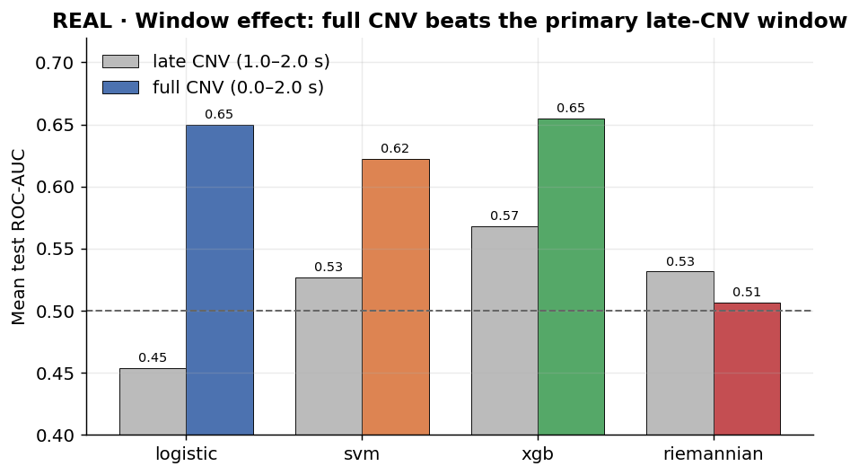

| Model | Family | Input | Role | Best real AUC seen | Verdict |
|---|---|---|---|---|---|
| **XGBoost** | Gradient-boosted trees | Tabular features | **Primary** | **0.65** (full CNV) | Invest here |
| SVM | Kernel margin | Tabular features | Comparator | 0.62 (full CNV) | Keep as comparator |
| Logistic | Linear | Tabular features | Baseline / smoke | 0.65 (full CNV) | Surprisingly strong on full CNV |
| BiLSTM | Recurrent NN | Sequence | Deep comparator | not yet screened | Needs real windowing first |
| Riemannian | Covariance + LDA | Raw epoch tensor | Comparator | 0.53 | Calibrated but flat |
| CNN | Conv NN (hybrid) | Tensor + tabular | Comparator | 0.63 baseline (late) | Promising; window-limited |
| EEGNet | Conv NN (hybrid) | Tensor + tabular | Comparator | **0.94** baseline (full, P13) | Strongest single-subject signal |
| Shrinkage-LDA | Linear discriminant | 9-ch ERP bins | ERP benchmark | not yet run | Cheap sanity baseline |

> ⚠️ AUCs above come from different cohort sizes, tiers, and windows — see
> [§6](#6-real-results-so-far) for the apples-to-apples caveats. They are
> directional, not a leaderboard.

---

## 2. The shared setup every model plugs into

Every model is a **factory** registered in `train.py`'s `MODEL_FACTORIES`. The
generic driver fits and evaluates each participant **independently** under
nested cross-validation, so "the model" is really *model + feature-selection
schedule + CV protocol*. Understanding this shared scaffold is the key to
reading any single model's tunables.

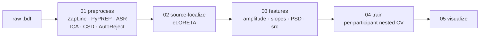

**Inputs come in two shapes**, and which one a model consumes is its single
most important architectural fact:

- **Tabular feature parquet** `(n_epochs, n_features)` — binned amplitudes,
  slopes, PSD band-powers, eLORETA source activations. Used by **XGBoost, SVM,
  Logistic, LSTM, Shrinkage-LDA**.
- **Raw epoch tensor** `(n_epochs, n_channels, n_times)` — cleaned scalp EEG.
  Used by **Riemannian, CNN, EEGNet** (the neural models also *fuse* in the
  tabular branch).

**Prediction windows.** Primary = **late CNV (1.0–2.0 s)**, where foot-motor
preparation is expected to peak. Secondary = **full CNV (0.0–2.0 s)**. Feature
caches are window-aware, so the two never reuse each other's parquets. _As the
results show, this choice turned out to dominate everything else._

**The in-fold feature-selection funnel** (tabular models). Each stage is fit on
the training fold only and applied to the test fold — this is what keeps the
inner-vs-outer AUC gap honest. Counts below are nominal/illustrative.

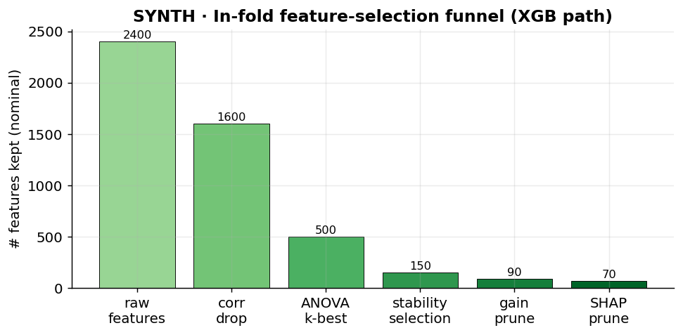

| Stage | Default | Applies to |
|---|---|---|
| Correlation drop (`|r| > 0.9`) | on | all tabular |
| ANOVA F-test k-best (`k=500`) | on | all tabular |
| Stability selection (elastic-net, Shah–Samworth) | **default selector** | all tabular |
| Iterated RFECV | legacy / opt-in | XGB only |
| Gain prune + refit | on | XGB only |
| SHAP prune + refit (`quantile 0.20`) | derived | XGB only |

Tensor models (Riemannian / CNN / EEGNet) **skip the funnel** — feature
selection is undefined on `(n_epochs, n_channels, n_times)` input.

---

## 3. Model roster

| # | Model | File | Library | Search method | Tunable knobs (high level) |
|---|---|---|---|---|---|
| 1 | XGBoost | `models/xgb.py` | `xgboost` | HalvingRandomSearchCV | depth, learning_rate, n_estimators, regularization, sampling |
| 2 | SVM | `models/svm.py` | `sklearn.svm.SVC` | GridSearchCV | C, gamma, kernel, degree |
| 3 | Logistic | `models/logistic.py` | `sklearn` | GridSearchCV | C (regularization strength) |
| 4 | BiLSTM | `models/lstm.py` | Keras + scikeras | GridSearchCV | units, dropout, epochs, batch |
| 5 | Riemannian | `models/riemannian.py` | `pyriemann` + sklearn LDA | GridSearchCV | nfilter, covariance estimator, shrinkage, bands |
| 6 | CNN | `models/cnn.py` | Keras + scikeras | GridSearchCV | filters, kernels, pooling, dropout, l2, lr, fusion |
| 7 | EEGNet | `models/eegnet.py` | Keras + scikeras | GridSearchCV | F1, depth_mult, F2, kernels, dropout, norm_rate, lr |
| 8 | Shrinkage-LDA | `features/cnv_benchmark.py` + LDA | sklearn | none (closed-form) | bin width, channel set, shrinkage |

---

## 4. Per-model deep dives

Each model below has: **architecture**, a **tunable-characteristics table**
(what each knob *does*), and a figure. Illustrative (`SYNTH`) figures show the
shape of a tuning effect on made-up data; the real numbers live in
[§6](#6-real-results-so-far).

---

### 4.1 XGBoost — primary

Gradient-boosted decision trees (`XGBClassifier`, `binary:logistic`,
`tree_method=hist`). The primary model because it handles wide, mixed-scale
tabular features without hand-tuned preprocessing, exposes `feature_importances_`
and SHAP for the prune stages, and multithreads natively. Class imbalance is
handled per fold via `scale_pos_weight = neg/pos`.

**How boosting works:** trees are added sequentially, each correcting the
residual errors of the ensemble so far; `learning_rate` shrinks each tree's
contribution so more trees can be added before overfitting.

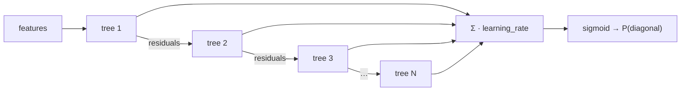

| Hyperparameter | Grid (`default.yaml`) | What tuning it does |
|---|---|---|
| `n_estimators` | up to 1000 (halving resource) | Number of boosting rounds. More = lower bias but higher overfit risk; paired with `learning_rate`. |
| `learning_rate` | `0.01, 0.03, 0.05` | Shrinks each tree's step. Lower = needs more trees but generalizes better. The classic speed/accuracy dial. |
| `max_depth` | `2, 4, 8, 16` | Max interactions per tree. The main **bias–variance** knob: shallow = underfit, deep = overfit. |
| `min_child_weight` | `1` | Min summed instance weight in a leaf. Higher = more conservative splits (regularizes). |
| `gamma` | `0, 0.1, 0.3, 0.5, 1, 2` | Min loss reduction to split. Higher = prunes weak splits → simpler trees. |
| `reg_alpha` (L1) | `0, 0.1, 0.5` | L1 penalty on leaf weights → sparsity, drives weak features to zero. |
| `reg_lambda` (L2) | `1, 3, 5, 10` | L2 penalty on leaf weights → smooths, shrinks all weights. |
| `subsample` | `0.6, 0.8, 1.0` | Row fraction per tree. <1 adds randomness → variance reduction. |
| `colsample_bytree` / `bylevel` | `0.6, 0.7` / `0.6, 0.8` | Column fraction per tree / per level. Decorrelates trees, fights overfit on wide feature sets. |
| `scale_pos_weight` | computed `neg/pos` | Up-weights the minority class so the loss is balanced per fold. |

**`max_depth` is the knob you feel first** — it trades bias against variance
directly:

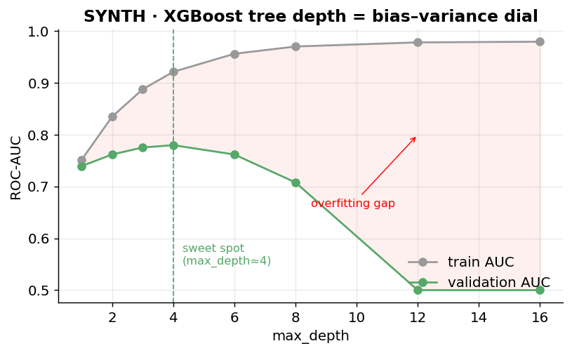

**`learning_rate` × `n_estimators`** is the second lever: a smaller rate needs
more rounds but reaches a higher, flatter ceiling.

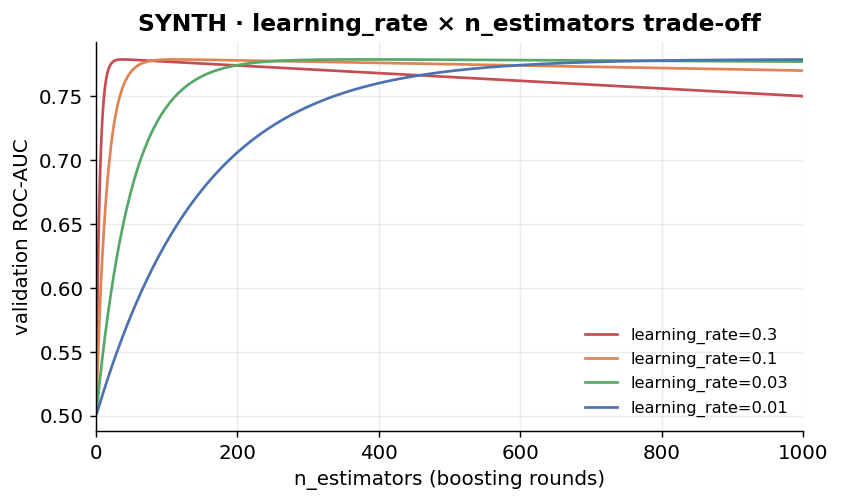

> **Search note:** XGB uses `HalvingRandomSearchCV` with `n_estimators` as the
> successive-halving *resource* (start 100 trees → keep the best → grow to
> 1000). This is why XGB can afford a much larger grid than the grid-searched
> models.

---

### 4.2 SVM — comparator

`sklearn.svm.SVC` with `probability=True` and `class_weight="balanced"`, wrapped
in a `StandardScaler` (kernels need comparably-scaled inputs). It finds the
**maximum-margin** separating hyperplane; the kernel decides how non-linear that
boundary can be. Used to confirm whether XGB's gains are tree-specific or
present in any strong classifier.

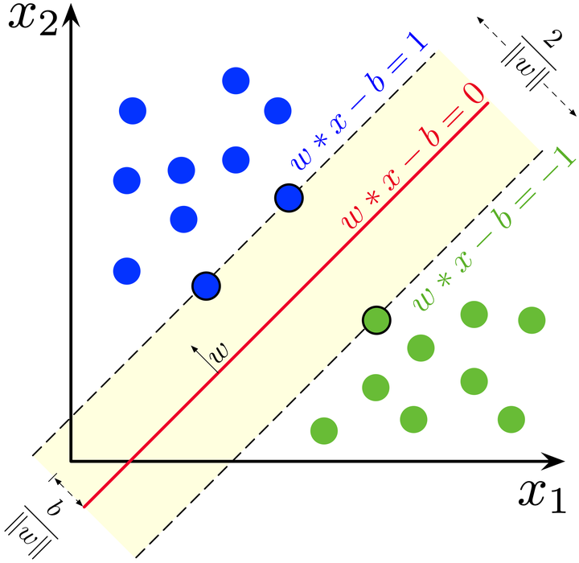

_Maximum-margin hyperplane: the boundary (red) is placed to maximise the margin
to the nearest points (support vectors). Source: Larhmam, Wikimedia Commons,
CC BY-SA 4.0._

| Hyperparameter | Grid | What tuning it does |
|---|---|---|
| `C` | `0.1, 1, 10, 100` | Regularization strength (inverse). Low C = wide, soft margin (more bias, tolerates errors); high C = hard margin (low bias, overfit risk). |
| `gamma` | `scale, auto, 0.001, 0.01, 0.1, 1.0` | RBF kernel width. High gamma = each point's influence is local → wiggly boundary (overfit); low gamma = smooth, near-linear. |
| `kernel` | `rbf, linear, poly` | The decision-boundary family: linear hyperplane vs RBF (local bumps) vs polynomial. |
| `degree` | `2, 3, 4` | Polynomial-kernel order (ignored for rbf/linear). Higher = more flexible polynomial boundary. |

**`C` and `gamma` interact** — they are tuned jointly, and the validation
surface usually has a diagonal ridge of good combinations:

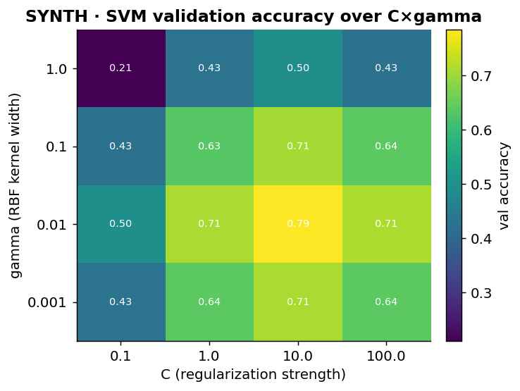

**Feature selection:** correlation drop + ANOVA k-best only (no RFECV/gain/SHAP —
SVC has no `feature_importances_`).

---

### 4.3 Logistic regression — baseline

`LogisticRegression` (`solver="liblinear"`, `class_weight="balanced"`,
`max_iter=2000`) in a `StandardScaler`. A linear log-odds model — the simplest
honest baseline, and the **smoke-test target** (full pipeline in seconds, not
hours). The sigmoid maps the linear score to a class probability:

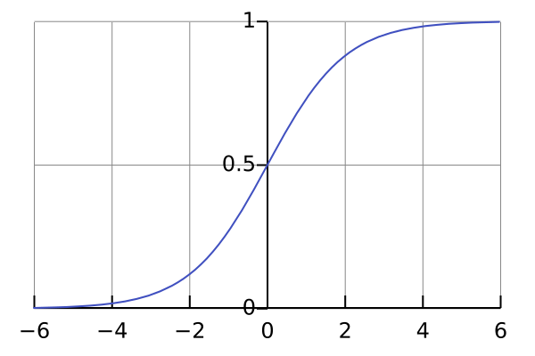

_The logistic (sigmoid) function squashes the linear score `w·x − b` into a
(0,1) probability. Source: Qef, Wikimedia Commons, public domain._

| Hyperparameter | Grid | What tuning it does |
|---|---|---|
| `C` | config (smoke default `{0.1, 1.0}`) | Inverse L2 strength. Low C = strong shrinkage → coefficients pulled toward 0 (more bias, less variance); high C = near-unregularized fit. |
| `penalty` | `l2` (liblinear default) | Regularization type. `liblinear` also supports `l1` for sparse coefficient selection if added to the grid. |
| `class_weight` | `balanced` (fixed) | Re-weights classes inversely to frequency so the minority class isn't ignored. |

**What `C` does to the coefficients** — strong regularization shrinks every
weight toward zero:

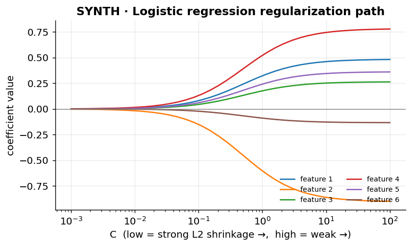

> **Worth noting:** on the *full*-CNV window logistic reaches ~0.65 AUC — tied
> with XGBoost — despite being linear. That says the full-window signal is
> largely linearly separable, which is itself a useful modelling clue.

---

### 4.4 Bidirectional LSTM — deep comparator

A Keras `Sequential` bidirectional LSTM wrapped in `scikeras.KerasClassifier`
so it plugs into the same GridSearchCV loop. Imports are deferred so the package
works without TensorFlow installed.

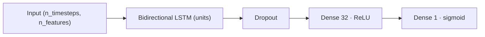

An LSTM cell carries a gated memory state across time, learning which past
information to keep or forget — well suited to a slow, ramping signal like the
CNV:

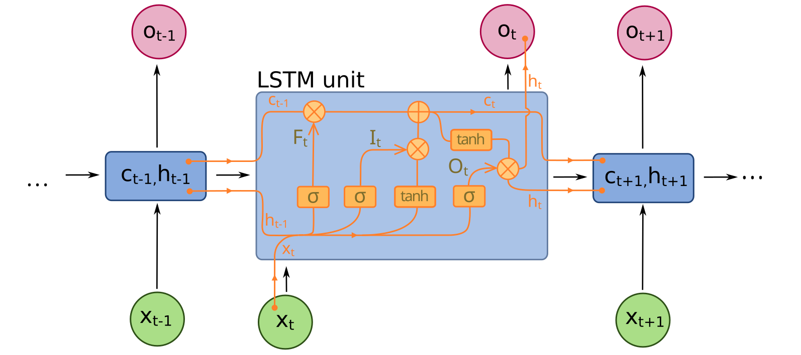

_One LSTM cell with input/forget/output gates. Source: fdeloche, Wikimedia
Commons, CC BY-SA 4.0._

| Hyperparameter | Grid | What tuning it does |
|---|---|---|
| `units` | `32, 64, 128` | Hidden-state width = model capacity. More units = can fit richer temporal patterns but overfits faster on small trial counts. |
| `dropout` | `0.2, 0.4` | Fraction of units zeroed each step. Higher = stronger regularization, smaller train–val gap. |
| `epochs` | `50` | Training passes. Too few underfits; too many overfits (no early stopping here). |
| `batch_size` | `32` | Examples per gradient step. Larger = smoother but coarser updates. |
| `optimizer` / `loss` | `adam` / `binary_crossentropy` (fixed) | Standard adaptive optimizer + log-loss for binary output. |

**Dropout** is the main regularizer for all three neural models — it closes the
train–val gap up to a point, then starts hurting:

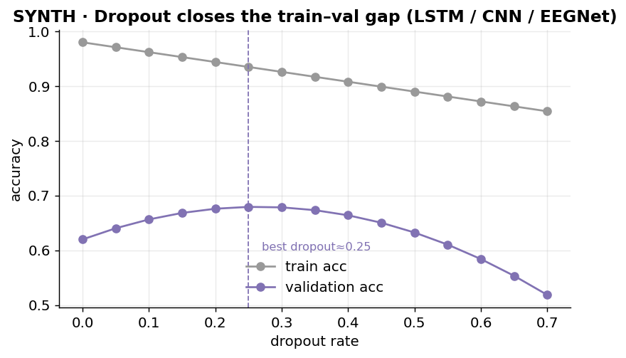

> ⚠️ **Known limitation:** the current driver passes **one timestep per
> feature** (legacy `CNV_LSTM_3.py` behaviour), so the LSTM isn't yet seeing a
> true time sequence. Real per-timestep windowing is a prerequisite before the
> LSTM result means anything — it is **not** in the screening table for this
> reason.

---

### 4.5 Riemannian — covariance comparator

Runs directly on the raw epoch tensor. The intuition: EEG class information
lives in the **spatial covariance** of the signal, and covariance matrices live
on a curved (Riemannian) manifold, so we project them to a flat **tangent space**
before a linear classifier. A strong, well-calibrated family for ERP/SCP shapes
like the CNV.

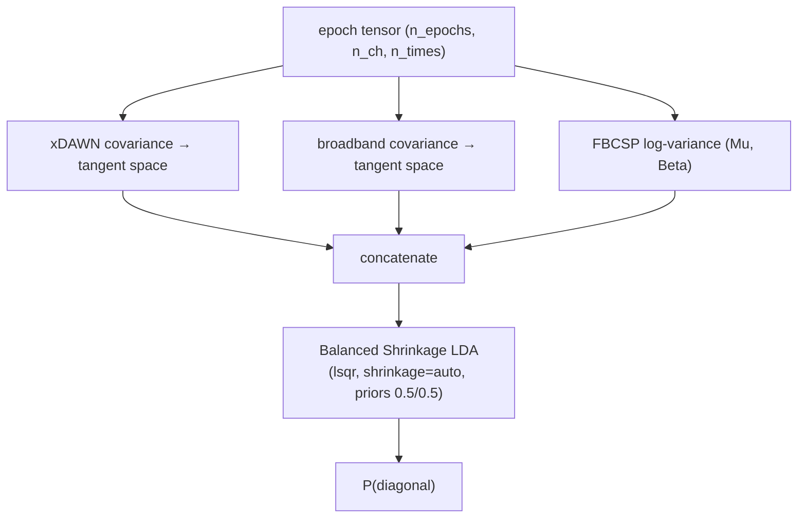

| Hyperparameter | Grid / default | What tuning it does |
|---|---|---|
| `nfilter` (xDAWN) | `2, 4, 6` | Number of xDAWN spatial filters. More = richer ERP subspace, but more parameters to estimate from few trials. |
| `covariance_estimator` | `oas` (default), `lwf` | Shrinkage covariance estimator. OAS/Ledoit-Wolf both stabilize covariance when channels > trials. |
| `shrinkage` (LDA) | `auto` | Pulls the class covariance toward a scaled identity. Higher shrinkage = stabler, lower-variance discriminant. |
| `fbcsp_bands` | `Mu 8–13`, `Beta 13–30` | Frequency bands for log-variance features (sensorimotor rhythms). |
| `tangent_metric` | `riemann` | Metric for tangent-space projection (geometry of the covariance manifold). |
| window | `full_cnv` (0–2 s) | Covariance structure changes across the whole motor-preparation interval, so the full window is used. |

**Why shrinkage matters here** — with 64 channels and few trials, the raw
covariance is ill-conditioned; shrinkage trades a little bias for a large
stability gain:

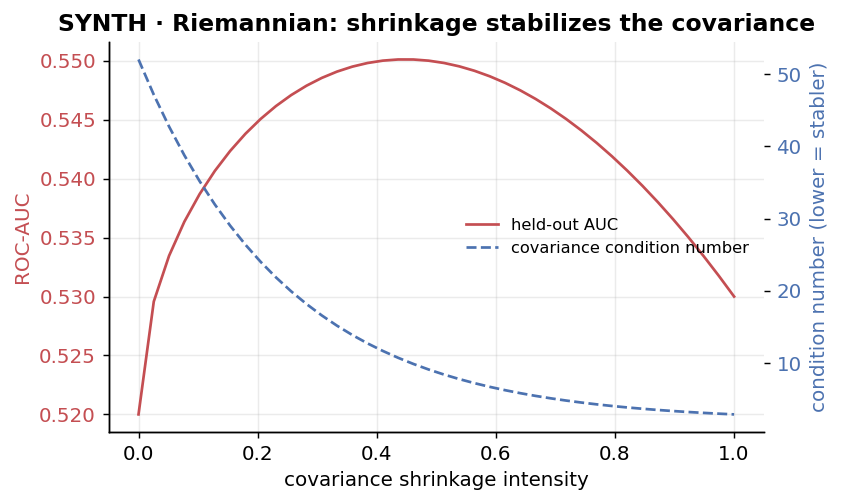

> **Real-data note:** Riemannian is the **only** model that *generalizes*
> (inner-vs-outer gap ~0.04–0.06 vs +0.20–0.29 for the classical models) — but
> its mean AUC never clears ~0.53. Calibrated, but currently flat. Requires the
> optional `riemannian` extra (`pip install -e .[riemannian]`).

---

### 4.6 CNN (EEGNet-lite hybrid)

A compact convolutional net on the raw tensor, **fused** with the XGB-style
tabular branch (including eLORETA source columns). Per-channel
exponential-moving standardization runs inside each fold. `require_source: true`
makes runs fail loudly if source columns are missing.

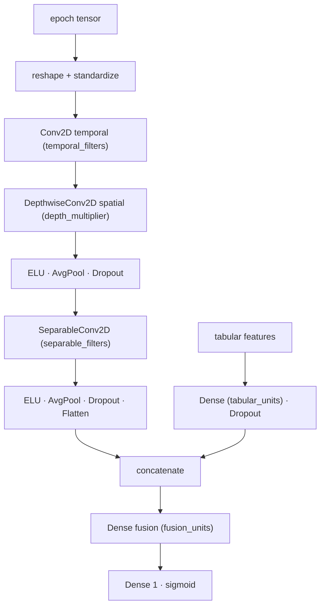

| Hyperparameter | Default | What tuning it does |
|---|---|---|
| `temporal_filters` | `8` | Number of learned temporal frequency filters. More = richer spectral vocabulary. |
| `depth_multiplier` | `2` | Spatial filters learned *per* temporal filter. Controls how many channel-combinations are formed. |
| `separable_filters` | `16` | Filters in the separable temporal block (higher-level temporal features). |
| `temporal_kernel` / `separable_kernel` | `65` / `17` | Receptive-field length in samples. Longer kernels see slower dynamics (good for the slow CNV). |
| `pool_1` / `pool_2` | `4` / `8` | Temporal downsampling. More pooling = coarser time, fewer params, less overfit. |
| `dropout` | `0.5` | Regularization strength (see dropout curve in §4.4). |
| `l2` | `1e-4` | Weight decay on conv/dense kernels. |
| `learning_rate` | `1e-3` | Adam step size. |
| `tabular_units` / `fusion_units` | `32` / `32` | Width of the tabular branch and the post-fusion layer. |
| `epochs` / `batch_size` | `30` / `16` | Training budget; early stopping (`patience 8`, `val_split 0.2`) guards overfit. |

> **Real-data note:** CNN diagnostics run on the **late** window (1–2 s) and sit
> at ~0.45–0.63 baseline AUC. Its time-occlusion map (see §6) shows the early
> part of the late window carries the most information.

---

### 4.7 EEGNet (hybrid)

A faithful local implementation of the **EEGNet** block (Lawhern et al., 2018):
the same temporal → depthwise-spatial → separable-temporal structure as the CNN
above, but with EEGNet's signature **max-norm weight constraints** (depthwise
`max_norm=1.0`, dense `max_norm=norm_rate`) instead of L2, and it runs on the
**full** 0–2 s window. Same hybrid fusion of tensor + tabular branches.

| Hyperparameter | Default | What tuning it does |
|---|---|---|
| `f1` | `8` | Temporal filters (EEGNet's F1). Spectral capacity of the first block. |
| `depth_multiplier` (D) | `2` | Spatial filters per temporal filter. EEGNet's depth parameter. |
| `f2` | `16` | Pointwise filters in the separable block (EEGNet's F2 ≈ F1·D). |
| `kernel_length` | `64` | Temporal kernel of the first conv ≈ half the sampling rate (captures ~2 Hz dynamics). |
| `separable_kernel_length` | `16` | Temporal kernel of the separable block. |
| `dropout_rate` | `0.5` | Regularization (EEGNet uses 0.5 for within-subject). |
| `norm_rate` | `0.25` | Max-norm constraint on the classifier weights — EEGNet's main regularizer. |
| `learning_rate` | `1e-3` | Adam step size. |
| `epochs` / `batch_size` | `50` / `16` | Training budget; early stopping `patience 10`. |

> **Real-data note (important):** the EEGNet starter ran on the **full** window
> and posts the **highest single-subject baseline AUCs in the project** — up to
> **0.94 (P13)** and **0.82 (P15)**, cohort baseline often 0.6–0.7. This is the
> strongest neural signal so far and reinforces the full-window finding. See the
> CNN-vs-EEGNet comparison in §6.

---

### 4.8 Shrinkage-LDA CNV benchmark

An opt-in, deliberately minimal ERP baseline: the `cnv_benchmark` feature block
computes **250 ms mean-amplitude bins** over the **9 medial motor channels**
(`Cz, FCz, CPz, C1, C2, FC1, FC2, CP1, CP2`), fed to a shrinkage LDA. It exists
to answer "how much can a textbook CNV-amplitude reading alone get us?" before
crediting any complex model.

| Hyperparameter | Default | What tuning it does |
|---|---|---|
| `bin_n` | `0.25 s` | Averaging window per bin. Wider = smoother, fewer features; narrower = more temporal detail. |
| `channels` | 9 medial motor | The ROI. Restricting to motor cortex tests the foot-motor-preparation hypothesis directly. |
| `shrinkage` | `auto` | LDA covariance shrinkage (stability vs bias, as in §4.5). |
| `enabled` | `false` | Off by default — add `cnv_benchmark` to `features.blocks` to emit it. |

> **Status:** scaffolded, not yet run as a benchmark. Cheap to add and a good
> "floor" reference for every other model.

---

## 5. Tuning machinery shared across models

Beyond per-model knobs, three cross-cutting controls shape every run.

**Nested cross-validation** (`modeling.cv`): outer `RepeatedStratifiedKFold`
(5 splits × 20 repeats by default) with an inner `StratifiedKFold` (3 splits)
for the hyperparameter search. A no-shuffle chronological check runs alongside
to catch temporal leakage.

**Search method** (`modeling.search.method`): one knob controls the search for
every model.

| `method` | XGBoost | All other models |
|---|---|---|
| `auto` (default) | `HalvingRandomSearchCV` (halving on `n_estimators`) | `GridSearchCV` |
| `grid` | `GridSearchCV` | `GridSearchCV` |
| `random` | `RandomizedSearchCV` | `RandomizedSearchCV` |
| `halving_random` | `HalvingRandomSearchCV` | grid (auto-fallback — no `n_estimators` resource) |

`random` samples `n_iter` (default 100) configurations from each grid for **every**
model, capped at the grid size. Note it drops XGB's successive-halving speedup,
so each XGB candidate trains the full `n_estimators` trees.

**Speed tiers** trade wall-time for thoroughness by trimming the grid, CV
repeats, and prune passes. Rough ladder (see `configs/README.md`):

| Tier | Use | Relative cost |
|---|---|---|
| `lightning` | single-participant smoke / iteration | lowest |
| `quick` / `express` | cohort screening (the screening results use **express**) | medium |
| `default` | full publication run | highest (hours) |
| `riemannian`, `cnn`, `eegnet` | model-specific overlays (set window, input path, source requirement) | varies |

**Feature-selection toggles** (XGB path) — each can be switched off to isolate
its effect:

| Key | Default | Effect when `false` |
|---|---|---|
| `modeling.rfecv.enabled` | legacy | Skip iterated RFECV. |
| `modeling.gain_prune.enabled` | `true` | Skip gain-prune subset + refit. |
| `modeling.shap_prune.enabled` | derived | Skip SHAP-prune subset + refit. |
| `modeling.feature_selection.method` | `stability` | `rfecv` (legacy) or `none`. |

---

## 6. Real results so far

_Source: `outputs/screening/` (runs 2026-05-14 → 2026-05-29, `scripts/06_compare_runs.py`)
and `outputs/diagnostics/` (CNN/EEGNet occlusion starters). AUC 0.50 = chance._

### Diagnostic 1 — mean test AUC ± 95% CI (early cohort, n=8, late window)

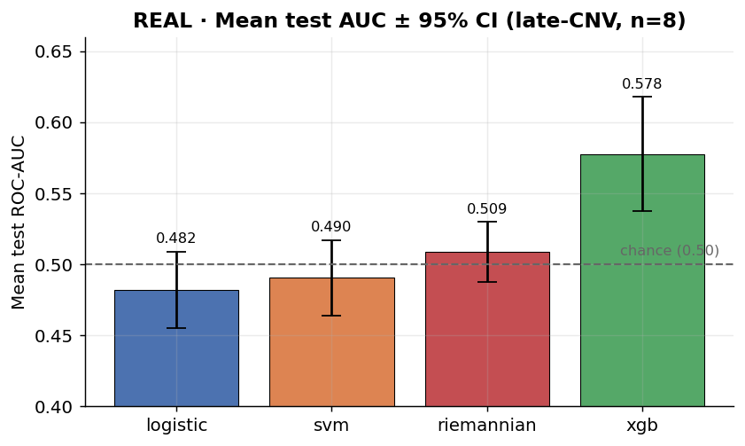

XGBoost (0.578) is the only model clearly above chance on the late window; the
classical linear/kernel models hover near 0.49.

### The window effect — the headline result


Same binning recipe, same 20-participant cohort, late vs full window. **Full CNV
lifts logistic by +0.20 and XGB by +0.09 AUC** — bigger than any tuning effect
observed. Riemannian is the exception (it's tuned for the full-window covariance
already and does *worse* on this recipe).

### Per-participant heterogeneity (n=8)

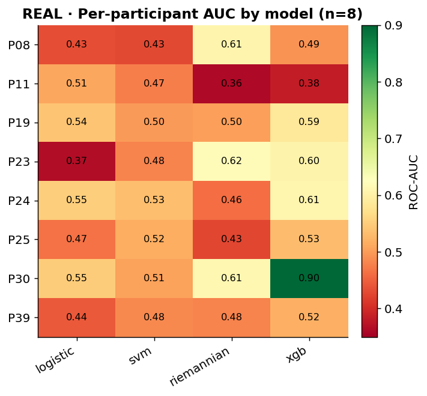

Signal is concentrated in a few subjects — **P30** is XGB's standout (0.90), while
**P08/P11** are hard for every classical model (Riemannian is often their best).
Scattered rankings → per-participant model selection or an ensemble may beat one
global model.

### Hybrid neural baselines — CNN (late) vs EEGNet (full)

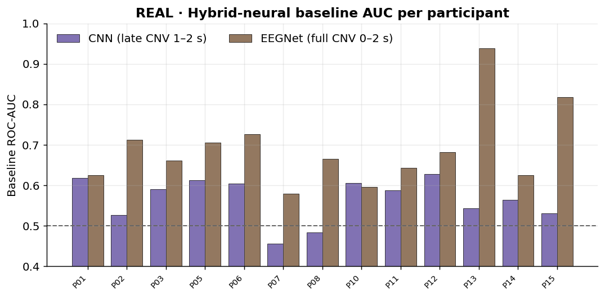

The full-window EEGNet baseline beats the late-window CNN baseline for **most
participants**, and reaches 0.94 on P13 — independent corroboration of the
window effect from a completely different model family.

### CNN time-occlusion — which moments matter

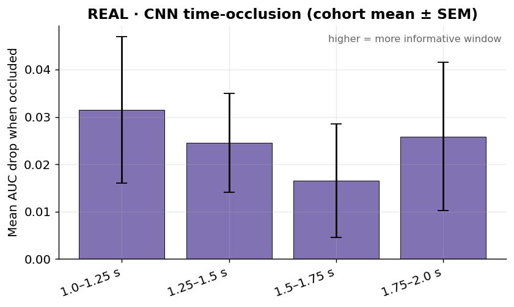

Occluding each 250 ms slice and measuring the AUC drop: within the late window,
the **earlier slices (1.0–1.5 s)** are the most informative on average — another
hint that the discriminative signal starts before the late window even opens.

### The five screening diagnostics, summarized

| Diagnostic | What it measures | Finding |
|---|---|---|
| D1 — mean AUC ± CI | accuracy | XGB best (0.58 late / 0.65 full); others near chance late. |
| D2 — tier-response slope | does more budget help? | Only XGB has positive slope (+0.016); logistic/SVM flat (near ceiling). |
| D3 — across-fold variance | stability | Moderate & similar (~0.10–0.16 SD); SVM most volatile. |
| D4 — inner-vs-outer gap | overfitting | Classical models overfit (+0.20–0.29); Riemannian generalizes (~0.05). |
| D5 — per-participant ranking | homogeneity | XGB most rank-1 finishes; rankings scattered → heterogeneous signal. |

---

## 7. Decision support — recommended next steps

Ordered by expected payoff (synthesized from the diagnostics above and
`outputs/screening/SCREENING_SUMMARY_2026-05-29.md`):

1. **Resolve the window question first.** Confirm the full-CNV advantage isn't a
   leakage/labeling artifact, then consider promoting full CNV (or a wider
   window) to the primary analysis. This is the single highest-leverage move —
   it dwarfs tuning.
2. **Center tuning on XGBoost.** It has the best AUC, the only non-flat tier
   slope, and the most rank-1 finishes. Deprioritize logistic/SVM tuning on the
   late window (flat and below chance there).
3. **Fix the inner-vs-outer overfitting gap** in the classical pipelines
   (lighter hyperparameter search, calibrated nested CV) before trusting any
   express-tier AUC as a real number.
4. **Complete the partial full-CNV runs.** `bin_full_cnv_stats_pyramid_core` has
   SVM on only 7 participants — run logistic/XGB on the full cohort to make the
   full-window comparison apples-to-apples.
5. **Try per-participant model selection / ensembling.** The scattered D5
   rankings and the heatmap say one global model is leaving signal on the table.
6. **Make the deep models real comparators:** give the **LSTM true per-timestep
   windowing** (current one-timestep hack invalidates its result), and scale the
   **EEGNet starter to the full cohort** given its strong single-subject AUCs.
7. **Run the shrinkage-LDA CNV benchmark** as a cheap floor — if a 9-channel ERP
   reading matches a tuned XGB, that reframes the whole modelling effort.

### Which model deserves investment?

| Question | If **yes** → | If **no** → |
|---|---|---|
| Need interpretable feature importances? | XGBoost (gain/SHAP) | EEGNet / CNN |
| Want calibrated probabilities now? | Riemannian (but low AUC) | tune XGB calibration |
| Is the signal linear (full window)? | Logistic is competitive & cheap | keep XGB/neural |
| Enough trials for deep nets? | EEGNet (full window) | classical + stability selection |

---

## 8. Progress tracker

**Legend:** ✅ done · 🟡 in progress / partial · ⚪ scaffolded, not run · ⬜ not started

| Area | Item | Status |
|---|---|---|
| Pipeline | Preprocess → src → features → train → visualize | ✅ |
| Pipeline | Window-aware feature caching (late / full) | ✅ |
| Models | XGBoost primary path (halving search, gain/SHAP prune) | ✅ |
| Models | SVM / Logistic comparators | ✅ |
| Models | Riemannian (xDAWN + TS + FBCSP → LDA) | ✅ scaffolded · 🟡 screened |
| Models | CNN hybrid (tensor + tabular) | 🟡 starter diagnostics only |
| Models | EEGNet hybrid | 🟡 starter diagnostics only |
| Models | BiLSTM with **true per-timestep windowing** | ⬜ blocked on windowing |
| Models | Shrinkage-LDA CNV benchmark | ⚪ enabled flag off |
| Screening | 4-model express screen (n=8, n=11) | ✅ |
| Screening | Late-vs-full window comparison | ✅ headline result |
| Screening | Full-CNV cohort for all classical models | 🟡 SVM-only partial run remains |
| Analysis | Confirm window effect is not leakage | ⬜ **next action** |
| Analysis | Inner-vs-outer gap mitigation | ⬜ |
| Analysis | Per-participant selection / ensembling | ⬜ |
| Analysis | Sliding-window AUC time-course | ⚪ configured, not run |

---

## Appendix A — hyperparameter grid reference

Verbatim from `configs/default.yaml` (`modeling:` block) — the search spaces the
screening runs actually used.

```yaml
xgb.param_grid:
  max_depth:         [2, 4, 8, 16]
  min_child_weight:  [1]
  reg_alpha:         [0, 0.1, 0.5]
  gamma:             [0, 0.1, 0.3, 0.5, 1, 2]
  reg_lambda:        [1, 3, 5, 10]
  colsample_bytree:  [0.6, 0.7]
  colsample_bylevel: [0.6, 0.8]
  learning_rate:     [0.01, 0.03, 0.05]
  subsample:         [0.6, 0.8, 1.0]

svm.param_grid:
  C:      [0.1, 1.0, 10.0, 100.0]
  gamma:  [scale, auto, 0.001, 0.01, 0.1, 1.0]
  kernel: [rbf, linear, poly]
  degree: [2, 3, 4]

lstm:
  units_grid:   [32, 64, 128]
  dropout_grid: [0.2, 0.4]
  epochs: 50
  batch_size: 32

riemannian:
  covariance_estimator: oas          # grid also sweeps lwf
  xdawn.nfilter: 4                    # grid sweeps [2, 4, 6]
  fbcsp_bands: { Mu: [8, 13], Beta: [13, 30] }

cnn / eegnet:                         # defaults; param_grid overridable per config
  temporal_filters/f1: 8
  depth_multiplier: 2
  separable_filters/f2: 16
  dropout(_rate): 0.5
  learning_rate: 1e-3
```

Search controls: `cv = RepeatedStratifiedKFold(5×20)`, inner `StratifiedKFold(3)`.
`modeling.search.method` selects the searcher for all models — `auto`
(`HalvingRandomSearchCV` for XGB with resource `n_estimators` 100→1000 factor 3,
`GridSearchCV` otherwise), `grid`, `random` (`RandomizedSearchCV` everywhere,
`n_iter=100`), or `halving_random`.

## Appendix B — figure provenance & licenses

| Figure | Kind | Source |
|---|---|---|
| `real_*.png` | **Real repo data** | `outputs/screening/*.md`, `outputs/diagnostics/*/participant_summary.csv` + `time_occlusion.csv` |
| `synth_*.png` | **Illustrative (made-up)** | generated by `docs/make_models_figs.py` to show the *shape* of a tuning effect — not project results |
| `wiki_svm_margin.png` | Reference diagram | Larhmam, [Wikimedia Commons](https://commons.wikimedia.org/wiki/File:SVM_margin.png), CC BY-SA 4.0 |
| `wiki_lstm_cell.svg` | Reference diagram | fdeloche, [Wikimedia Commons](https://commons.wikimedia.org/wiki/File:Long_Short-Term_Memory.svg), CC BY-SA 4.0 |
| `wiki_logistic_curve.svg` | Reference diagram | Qef, [Wikimedia Commons](https://commons.wikimedia.org/wiki/File:Logistic-curve.svg), public domain |

**Regenerate all data/illustrative figures:**

```bash
.venv/Scripts/python.exe docs/make_models_figs.py   # writes docs/models_figs/*.png
```

The two `wiki_*` reference diagrams are external assets (kept under
`docs/models_figs/`); they are not produced by the script.
