# Models — Architectures, Tuning, and Where We Stand

_EEG **step-type** classification (straight `One` vs diagonal `Two`) from CNV
signals recorded during a stepping task. MSc thesis project._

**Status:** living document · **Last updated:** 2026-09-21 · **Owner:** Ali

This document is the single place to (a) understand every model in the
pipeline, (b) see what each tunable actually controls, (c) read the real
results we have so far, and (d) decide what to do next. Figures are a mix of
**real repo data** (`REAL ·` titles), **illustrative made-up curves**
(`SYNTH ·` titles — they show what a knob *does*, not our results), and a few
**externally-sourced reference diagrams** (attributed in the
[appendix](#appendix-b--figure-provenance--licenses)).

---

## Contents

- [1. TL;DR — decision at a glance](#1-tldr--decision-at-a-glance)
- [2. The shared setup every model plugs into](#2-the-shared-setup-every-model-plugs-into)
- [3. Repository layout](#3-repository-layout)
- [4. Model roster](#4-model-roster)
- [5. Per-model deep dives](#5-per-model-deep-dives)
  - [5.1 XGBoost — primary](#51-xgboost--primary)
  - [5.2 SVM — comparator](#52-svm--comparator)
  - [5.3 Logistic regression — baseline](#53-logistic-regression--baseline)
  - [5.4 Bidirectional LSTM — deep comparator](#54-bidirectional-lstm--deep-comparator)
  - [5.5 Riemannian — covariance comparator](#55-riemannian--covariance-comparator)
  - [5.6 CNN (EEGNet-lite hybrid)](#56-cnn-eegnet-lite-hybrid)
  - [5.7 EEGNet (hybrid)](#57-eegnet-hybrid)
  - [5.7b EEGNet — PyTorch port](#57b-eegnet--pytorch-port-eegnet_torch)
  - [5.8 EEGNeXt — sophisticated hybrid CNN](#58-eegnext--sophisticated-hybrid-cnn)
  - [5.9 Shrinkage-LDA CNV benchmark](#59-shrinkage-lda-cnv-benchmark)
- [6. Tuning machinery shared across models](#6-tuning-machinery-shared-across-models)
- [7. Real results so far](#7-real-results-so-far)
- [8. Decision support — recommended next steps](#8-decision-support--recommended-next-steps)
- [9. Progress tracker](#9-progress-tracker)
- [Appendix A — hyperparameter grid reference](#appendix-a--hyperparameter-grid-reference)
- [Appendix B — figure provenance & licenses](#appendix-b--figure-provenance--licenses)

---

## 1. TL;DR — decision at a glance

> **Four things drive the next decision:**
> 1. **The prediction *window* matters more than the *model*.** Switching from
>    the late-CNV window (1.0–2.0 s) to the full-CNV window (0.0–2.0 s, now the
>    default) moves XGBoost from 0.568 to 0.655 AUC (same `rich_mean_0125`
>    recipe, n = 20; participant-level 95% CI ±0.060 on the 0.655 — see
>    [README](README.md#confidence-intervals)) and logistic from ~0.45 to ~0.65 —
>    far larger than any tuning effect seen so far.
> 2. **XGBoost is the classical model to invest in.** Highest AUC, most
>    per-participant rank-1 finishes, and the only model with non-flat
>    tier-response (room to improve with budget).
> 3. **No model is both accurate *and* well-calibrated yet.** The classical
>    models overfit the inner CV (gap +0.20 to +0.29); the Riemannian pipeline
>    is the only one that generalizes — but only at chance-level AUC.
> 4. **Cross-subject pooling eliminates the overfit gap *and* lifts held-out
>    AUC at once.** `partial` pooling (target's own training split + all other
>    subjects) moves XGBoost from 0.567 → 0.673 held-out AUC on an 8-subject
>    subset and collapses the inner-vs-outer gap from +0.177 to −0.036. See
>    [§7](#7-real-results-so-far).

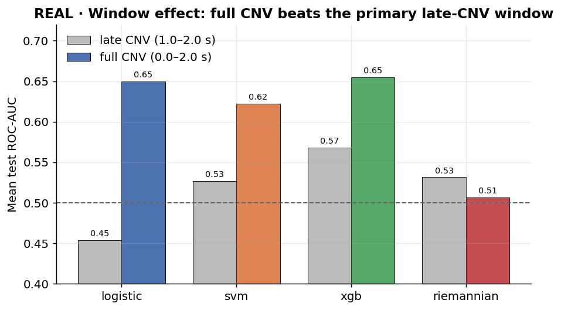

| Model | Family | Input | Role | Best real AUC seen | Verdict |
|---|---|---|---|---|---|
| **XGBoost** | Gradient-boosted trees | Tabular features | **Primary** | **0.673** (partial pool, full CNV, 8-subject demo); 0.655 per-participant at n = 20 | Invest here; pool for gap fix |
| SVM | Kernel margin | Tabular features | Comparator | 0.62 (full CNV) | Keep as comparator |
| Logistic | Linear | Tabular features | Baseline / smoke | 0.65 (full CNV) | Surprisingly strong on full CNV |
| BiLSTM | Recurrent NN | Sequence | Deep comparator | no result (excluded from screening) | Driver feeds one timestep per feature; needs real windowing first |
| Riemannian | Covariance + LDA | Raw epoch tensor | Comparator | 0.53 | Calibrated but flat |
| CNN | Conv NN (hybrid) | Tensor + tabular | Comparator | 0.63 baseline (late) | Promising; window-limited |
| EEGNet | Conv NN (hybrid) | Tensor + tabular | Comparator | **0.94** baseline (full, P13) — **in-sample**, not held out (§5.7b) | Strongest single-subject signal |
| EEGNet (PyTorch port) | Conv NN (hybrid) | Tensor + tabular | Framework port of EEGNet | 0.59 (P13, held-out, one-subject check) | Parity-tested against Keras; same model, not a new one |
| EEGNeXt | Multi-scale conv + SE + residual (hybrid) | Tensor + tabular | Comparator | not yet run | Sophisticated upgrade of EEGNet |
| Shrinkage-LDA | Linear discriminant | 9-ch ERP bins | ERP benchmark | not yet run | Cheap sanity baseline |

> ⚠️ AUCs above come from different cohort sizes, tiers, and windows — see
> [§7](#7-real-results-so-far) for the apples-to-apples caveats. They are
> directional, not a leaderboard.

---

## 2. The shared setup every model plugs into

Every model is a **factory** registered in `train.py`'s `MODEL_FACTORIES`. The
generic driver fits and evaluates each participant **independently** under
nested cross-validation, so "the model" is really *model + feature-selection
schedule + CV protocol*. Understanding this shared scaffold is the key to
reading any single model's tunables.

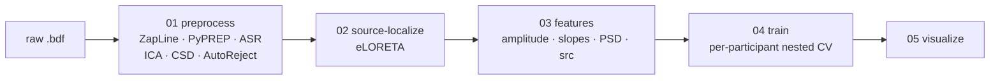
```mermaid
flowchart LR
    A["raw .bdf"] --> B["01 preprocess<br/>ZapLine · PyPREP · ASR<br/>ICA · CSD · AutoReject"]
    B --> C["02 source-localize<br/>eLORETA"]
    C --> D["03 features<br/>amplitude · slopes · PSD · src"]
    D --> E["04 train<br/>per-participant nested CV"]
    E --> F["05 visualize"]
```

**Inputs come in two shapes**, and which one a model consumes is its single
most important architectural fact:

- **Tabular feature parquet** `(n_epochs, n_features)` — binned amplitudes,
  slopes, PSD band-powers, eLORETA source activations. Used by **XGBoost, SVM,
  Logistic, LSTM, Shrinkage-LDA**.
- **Raw epoch tensor** `(n_epochs, n_channels, n_times)` — cleaned scalp EEG.
  Used by **Riemannian, CNN, EEGNet, EEGNet-torch, EEGNeXt** (the neural
  models also *fuse* in the tabular branch).

**Prediction windows.** Primary (the default for every model,
`prediction_windows.primary` in `configs/default.yaml`) = **full CNV
(0.0–2.0 s)**. Secondary = **late CNV (1.0–2.0 s)**, where foot-motor
preparation is expected to peak; it was the primary window until the full window
proved stronger. Feature caches are window-aware, so the two never reuse each
other's parquets. _As the results show, this choice turned out to dominate
everything else._

**The in-fold feature-selection funnel** (tabular models). Each stage is fit on
the training fold only and applied to the test fold — this is what keeps the
inner-vs-outer gap honest. Counts below are nominal/illustrative.

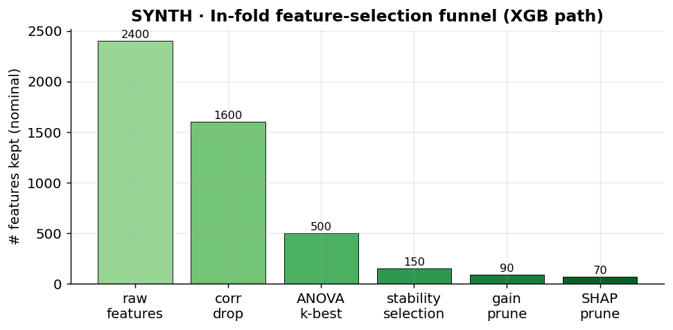

| Stage | Default | Applies to |
|---|---|---|
| Correlation drop (`|r| > 0.9`) | on | all tabular |
| ANOVA F-test k-best (`k=500`) | on | all tabular |
| Stability selection (elastic-net, Shah–Samworth) | **default selector** | all tabular |
| Iterated RFECV | legacy / opt-in | XGB only |
| Gain prune + refit | on | XGB only |
| SHAP prune + refit (`quantile 0.20`) | derived | XGB only |

Tensor models (Riemannian / CNN / EEGNet / EEGNet-torch / EEGNeXt) **skip the
funnel** —
feature selection is undefined on `(n_epochs, n_channels, n_times)` input.

---

## 3. Repository layout

The repo is an installable Python package (`pip install -e .`) driven by a
config-file stack. Below is the full directory structure of everything that
matters for the ML pipeline. New files added since the initial pipeline
reorganisation are marked `[NEW]`.

```
ML/
├── run.py                            — single-process pipeline driver (--stages preprocess/src/features/train/visualize)
├── Makefile                          — install / smoke / test / train shortcuts
├── pyproject.toml                    — package metadata; extras: [lstm], [torch], [riemannian], [dev]
├── Dockerfile / .dockerignore        — CPU-only image (py3.12, dev+torch extras); CMD runs pytest
├── .github/workflows/ci.yml          — CI: ruff + pytest on py3.12, and the suite inside the image
│
├── MODELS.md                         — this document (architectures, results, decisions)
├── XGB_MODEL_SUMMARY.md              — XGBoost-focused status report (§3.5 has pooling results)
├── CHANGELOG.md                      — version history
├── README.md                         — quick-start guide
├── SCRIPT_GUIDES.md                  — CLI reference and operator recipes
│
├── configs/
│   ├── default.yaml                  — committed defaults (all models, feature blocks, CV, search)
│   ├── smoke.yaml                    — tiny end-to-end check (logistic, 1 participant, shrunk grids)
│   ├── single.yaml                   — single-participant convenience overlay
│   ├── lightning.yaml                — fastest single-participant speed tier
│   ├── quick.yaml                    — cohort screening tier (light CV)
│   ├── express.yaml                  — cohort screening tier (moderate CV; used for D1–D5 results)
│   ├── _run5_quick.yaml              — internal screening overlay
│   ├── riemannian.yaml               — Riemannian model overlay (full window, tensor input path)
│   ├── cnn.yaml                      — CNN overlay (require_source, full window)
│   ├── eegnet.yaml                   — EEGNet overlay (require_source, full window)
│   ├── eegnet_torch.yaml             — EEGNet PyTorch-port overlay (clone of eegnet.yaml)
│   ├── eegnext.yaml                  — EEGNeXt overlay (multi-scale kernels, SE, residual blocks)
│   ├── features_rich.yaml            — rich feature-set override (more bin widths + stats)
│   ├── pooling_compare.yaml   [NEW]  — 8-subject / reduced-feature pooling comparison overlay
│   └── overrides/
│       └── Pxx.yaml × 34            — per-participant path/preprocessing tweaks (bad channels,
│                                       ICA excludes, crop windows, multi-file concat)
│
├── scripts/
│   ├── 00_preflight.py               — sanity-check raw files and configured paths
│   ├── 01_preprocess.py              — raw .bdf → epoched .fif (PyPREP / ICA / ASR / autoreject)
│   ├── 02_source_localize.py         — eLORETA source estimation (.fif → src/*.csv)
│   ├── 03_extract_features.py        — feature parquet + tensor .npz cache builder
│   ├── 04_train.py                   — per-participant nested-CV training (all models)
│   ├── 05_visualize.py               — per-run result plots
│   ├── 06_compare_runs.py            — cross-run screening diagnostics (D1–D5 AUC/tier/gap/rank)
│   ├── 07_feature_informativeness.py — feature importance / SHAP across cohort
│   ├── 08_tensor_model_diagnostics.py— channel/time-occlusion probes (CNN / EEGNet / EEGNeXt)
│   ├── 09_pooling_comparison.py [NEW]— per_participant / partial / full cross-subject comparison
│   └── _xgb_perf_snapshot.py        — XGBoost express-tier reproduction helper
│
├── src/eeg_steptype/
│   ├── __init__.py
│   ├── config.py                     — YAML loading, overlay merging, participant-override dispatch
│   ├── io.py                         — run-dir helpers, path builders, CSV/parquet writes
│   ├── logging_utils.py              — structured logging, run-stamp (config + git SHA), run-id gen
│   ├── preflight.py                  — path / raw-file existence checks
│   ├── progress.py                   — fold/cohort ETA trackers
│   ├── resources.py                  — n_jobs / CPU detection
│   │
│   ├── preprocessing/                — raw → epoch pipeline
│   │   ├── __init__.py
│   │   ├── pipeline.py               — orchestrates the full preprocessing sequence
│   │   ├── load.py                   — raw .bdf reading (handles multi-file concat per overrides)
│   │   ├── filter.py                 — ZapLine line-noise + bandpass filter (default 0.1–40 Hz)
│   │   ├── bads.py                   — PyPREP bad-channel detection + interpolation
│   │   ├── reference.py              — CSD + mastoid/average reference
│   │   ├── ica.py                    — MNE-ICALabel automated ICA (p > 0.9 conservative threshold)
│   │   ├── asr.py                    — ASR artefact subspace reconstruction
│   │   ├── reject.py                 — autoreject per-channel amplitude thresholds
│   │   ├── epoching.py               — event extraction → MNE Epochs
│   │   ├── events.py                 — event-code helpers
│   │   └── montage.py                — channel layout / digitization
│   │
│   ├── source_localization/          — eLORETA source estimation
│   │   ├── __init__.py
│   │   ├── pipeline.py               — orchestrates fwd + inv + apply (hoists ops out of epoch loop)
│   │   ├── forward.py                — cached BEM forward-model build
│   │   ├── inverse.py                — noise-covariance + eLORETA inverse operator
│   │   ├── labels.py                 — ROI label-to-source index mapping
│   │   └── diagnostics.py            — source-space QC plots
│   │
│   ├── features/                     — feature extraction (all blocks write to one parquet)
│   │   ├── __init__.py
│   │   ├── assemble.py               — assembles all enabled blocks into one (n_epochs, n_features) parquet
│   │   ├── amplitude.py              — binned amplitude statistics (mean/std/min/max/median × bin widths)
│   │   ├── slopes.py                 — per-channel linear-trend slope features
│   │   ├── psd.py                    — Morlet TFR band-power features (delta/theta/alpha/beta/gamma)
│   │   ├── basis.py                  — shape-decomposition features: Legendre/Chebyshev polys,
│   │   │                               B-splines, in-fold functional PCA (leakage-safe)
│   │   ├── tensor.py                 — (n_epochs, n_ch, n_times) .npz cache builder for neural models
│   │   └── cnv_benchmark.py          — 9-channel 250 ms bin features for the shrinkage-LDA benchmark
│   │
│   ├── models/                       — classifiers + training machinery
│   │   ├── __init__.py
│   │   ├── train.py                  — generic nested-CV driver; MODEL_FACTORIES + NEURAL_HYBRID_MODELS
│   │   ├── pooling.py         [NEW]  — cross-subject workflows: per_participant / partial / full
│   │   ├── feature_selection.py      — corr-drop, k-best, RFECV, stability selection, gain, SHAP prune
│   │   ├── evaluate.py               — per-participant metrics + cohort rollup (+ overfit gap)
│   │   ├── normalization.py          — StandardScaler / max-norm wrappers; routes models to correct norm
│   │   ├── xgb.py                    — XGBoost factory (primary model)
│   │   ├── svm.py                    — sklearn SVC factory
│   │   ├── logistic.py               — sklearn LogisticRegression factory
│   │   ├── lstm.py                   — Keras Sequential BiLSTM factory (needs [lstm] extra)
│   │   ├── riemannian.py             — xDAWN + tangent-space + FBCSP → shrinkage-LDA factory
│   │   ├── cnn.py                    — EEGNet-lite hybrid CNN factory
│   │   ├── eegnet.py                 — EEGNet hybrid factory (max-norm weight constraints)
│   │   ├── eegnet_torch.py           — PyTorch port of eegnet (nn.Module + sklearn wrapper)
│   │   └── eegnext.py                — multi-scale + SE + residual hybrid CNN factory
│   │
│   └── viz/
│       ├── __init__.py
│       └── results.py                — run-level AUC / gap / heatmap plotting helpers
│
├── tests/
│   ├── __init__.py
│   ├── conftest.py                   — shared fixtures (smoke_config_path, tmp run dirs)
│   ├── test_imports.py               — imports smoke test + registry/normalizer/diagnostic parity guards
│   ├── test_smoke_pipeline.py        — synthetic end-to-end pipeline check (< 60 s, no real data)
│   ├── test_basis_features.py        — shape-decomposition (Legendre/B-spline/fPCA) unit tests
│   ├── test_stability_select.py      — stability-selection unit tests (synthetic data, no MNE)
│   ├── test_eegnet_torch.py          — PyTorch port: Keras parity, max-norm, wrapper, end-to-end
│   └── test_pooling.py       [NEW]  — pooling data-sharing semantics (per/partial/full, 4-subject toy)
│
├── docs/
│   ├── make_models_figs.py           — regenerates all REAL + SYNTH figures in models_figs/
│   ├── OVERFITTING_GAP_SOLUTIONS.md  [NEW] — structured remedies for the +0.17–0.24 inner-vs-outer gap
│   └── models_figs/
│       ├── real_*.png                — actual project results (AUC CI, window effect, heatmap, …)
│       ├── synth_*.png               — illustrative tuning-effect curves (made-up data)
│       └── wiki_*.svg / *.png        — reference diagrams (attributed; see Appendix B)
│
└── legacy/                           — original scripts (gitignored from outputs/, kept for reference)
    ├── 01_preprocessing/             — per-participant raw → epoch scripts
    ├── 02_models/
    │   ├── archive/                  — CNV_ML*.py iterations
    │   ├── lstm/                     — CNV_LSTM_3.py
    │   ├── svm/                      — CNV_ML_SVM_1.py
    │   └── xgboost/                  — CNV_XGB_4.3.py (latest legacy XGB)
    └── 03_visualization/             — R and Python visualization scripts
```

---

## 4. Model roster

| # | Model | File | Library | Search method | Tunable knobs (high level) |
|---|---|---|---|---|---|
| 1 | XGBoost | `models/xgb.py` | `xgboost` | HalvingRandomSearchCV | depth, learning_rate, n_estimators, regularization, sampling |
| 2 | SVM | `models/svm.py` | `sklearn.svm.SVC` | GridSearchCV | C, gamma, kernel, degree |
| 3 | Logistic | `models/logistic.py` | `sklearn` | GridSearchCV | C (regularization strength) |
| 4 | BiLSTM | `models/lstm.py` | Keras + scikeras | GridSearchCV | units, dropout, epochs, batch |
| 5 | Riemannian | `models/riemannian.py` | `pyriemann` + sklearn LDA | GridSearchCV | nfilter, covariance estimator, shrinkage, bands |
| 6 | CNN | `models/cnn.py` | Keras + scikeras | GridSearchCV | filters, kernels, pooling, dropout, l2, lr, fusion |
| 7 | EEGNet | `models/eegnet.py` | Keras + scikeras | GridSearchCV | F1, depth_mult, F2, kernels, dropout, norm_rate, lr |
| 7b | EEGNet (PyTorch port) | `models/eegnet_torch.py` | PyTorch (hand-rolled sklearn wrapper) | GridSearchCV | identical to row 7 (F1, depth_mult, F2, kernels, dropout, norm_rate, lr) |
| 8 | EEGNeXt | `models/eegnext.py` | Keras + scikeras | GridSearchCV | multi-scale kernels, F1/F2, depth_mult, SE ratio, residual depth, dropout, norm_rate, lr, fusion |
| 9 | Shrinkage-LDA | `features/cnv_benchmark.py` + LDA | sklearn | none (closed-form) | bin width, channel set, shrinkage |

**Nine of these are registered** in `MODEL_FACTORIES` (`models/train.py`) and
selectable with `--model`: `xgb`, `svm`, `lstm`, `logistic`, `riemannian`,
`cnn`, `eegnet`, `eegnet_torch`, `eegnext`. Row 9, the shrinkage-LDA CNV
benchmark, is a feature block (`features/cnv_benchmark.py`) plus a stock
sklearn LDA rather than a registered factory, so it is not selectable that way.

**Training workflow modules** (not model factories — they reuse the same factories above):

| Module | File | Models supported | What it adds |
|---|---|---|---|
| Cross-subject pooling | `models/pooling.py` | `xgb`, `svm`, `logistic` | Three data-sharing modes: `per_participant` (baseline), `partial` (global prior + local), `full` (leave-one-subject-out). Subject-grouped inner CV prevents search from peeking across the train/test subject boundary. |

---

## 5. Per-model deep dives

Each model below has: **architecture**, a **tunable-characteristics table**
(what each knob *does*), and a figure. Illustrative (`SYNTH`) figures show the
shape of a tuning effect on made-up data; the real numbers live in
[§7](#7-real-results-so-far).

---

### 5.1 XGBoost — primary

Gradient-boosted decision trees (`XGBClassifier`, `binary:logistic`,
`tree_method=hist`). The primary model because it handles wide, mixed-scale
tabular features without hand-tuned preprocessing, exposes `feature_importances_`
and SHAP for the prune stages, and multithreads natively. Class imbalance is
handled per fold via `scale_pos_weight = neg/pos`.

**How boosting works:** trees are added sequentially, each correcting the
residual errors of the ensemble so far; `learning_rate` shrinks each tree's
contribution so more trees can be added before overfitting.

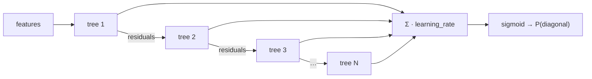
```mermaid
flowchart LR
    F["features"] --> T1["tree 1"]
    T1 -- residuals --> T2["tree 2"]
    T2 -- residuals --> T3["tree 3"]
    T3 -- "…" --> TN["tree N"]
    T1 --> S["Σ · learning_rate"]
    T2 --> S
    T3 --> S
    TN --> S
    S --> P["sigmoid → P(diagonal)"]
```

| Hyperparameter | Grid (`default.yaml`) | What tuning it does |
|---|---|---|
| `n_estimators` | up to 1000 (halving resource) | Number of boosting rounds. More = lower bias but higher overfit risk; paired with `learning_rate`. |
| `learning_rate` | `0.01, 0.03, 0.05` | Shrinks each tree's step. Lower = needs more trees but generalizes better. The classic speed/accuracy dial. |
| `max_depth` | `2, 4, 8, 16` | Max interactions per tree. The main **bias–variance** knob: shallow = underfit, deep = overfit. |
| `min_child_weight` | `1` | Min summed instance weight in a leaf. Higher = more conservative splits (regularizes). |
| `gamma` | `0, 0.1, 0.3, 0.5, 1, 2` | Min loss reduction to split. Higher = prunes weak splits → simpler trees. |
| `reg_alpha` (L1) | `0, 0.1, 0.5` | L1 penalty on leaf weights → sparsity, drives weak features to zero. |
| `reg_lambda` (L2) | `1, 3, 5, 10` | L2 penalty on leaf weights → smooths, shrinks all weights. |
| `subsample` | `0.6, 0.8, 1.0` | Row fraction per tree. <1 adds randomness → variance reduction. |
| `colsample_bytree` / `bylevel` | `0.6, 0.7` / `0.6, 0.8` | Column fraction per tree / per level. Decorrelates trees, fights overfit on wide feature sets. |
| `scale_pos_weight` | computed `neg/pos` | Up-weights the minority class so the loss is balanced per fold. |

**`max_depth` is the knob you feel first** — it trades bias against variance
directly:

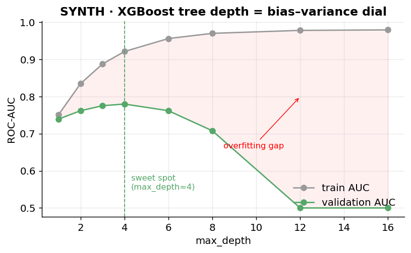

**`learning_rate` × `n_estimators`** is the second lever: a smaller rate needs
more rounds but reaches a higher, flatter ceiling.

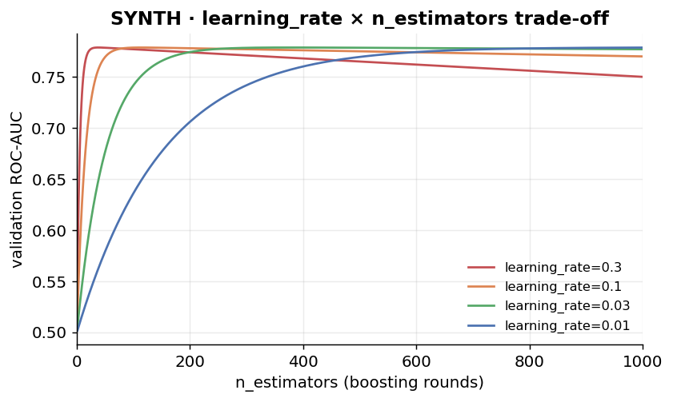

> **Search note:** XGB uses `HalvingRandomSearchCV` with `n_estimators` as the
> successive-halving *resource* (start 100 trees → keep the best → grow to
> 1000). This is why XGB can afford a much larger grid than the grid-searched
> models.

---

### 5.2 SVM — comparator

`sklearn.svm.SVC` with `probability=True` and `class_weight="balanced"`, wrapped
in a `StandardScaler` (kernels need comparably-scaled inputs). It finds the
**maximum-margin** separating hyperplane; the kernel decides how non-linear that
boundary can be. Used to confirm whether XGB's gains are tree-specific or
present in any strong classifier.

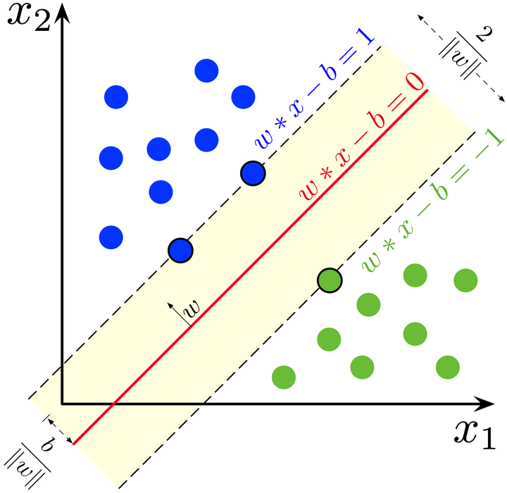

_Maximum-margin hyperplane: the boundary (red) is placed to maximise the margin
to the nearest points (support vectors). Source: Larhmam, Wikimedia Commons,
CC BY-SA 4.0._

| Hyperparameter | Grid | What tuning it does |
|---|---|---|
| `C` | `0.1, 1, 10, 100` | Regularization strength (inverse). Low C = wide, soft margin (more bias, tolerates errors); high C = hard margin (low bias, overfit risk). |
| `gamma` | `scale, auto, 0.001, 0.01, 0.1, 1.0` | RBF kernel width. High gamma = each point's influence is local → wiggly boundary (overfit); low gamma = smooth, near-linear. |
| `kernel` | `rbf, linear, poly` | The decision-boundary family: linear hyperplane vs RBF (local bumps) vs polynomial. |
| `degree` | `2, 3, 4` | Polynomial-kernel order (ignored for rbf/linear). Higher = more flexible polynomial boundary. |

**`C` and `gamma` interact** — they are tuned jointly, and the validation
surface usually has a diagonal ridge of good combinations:

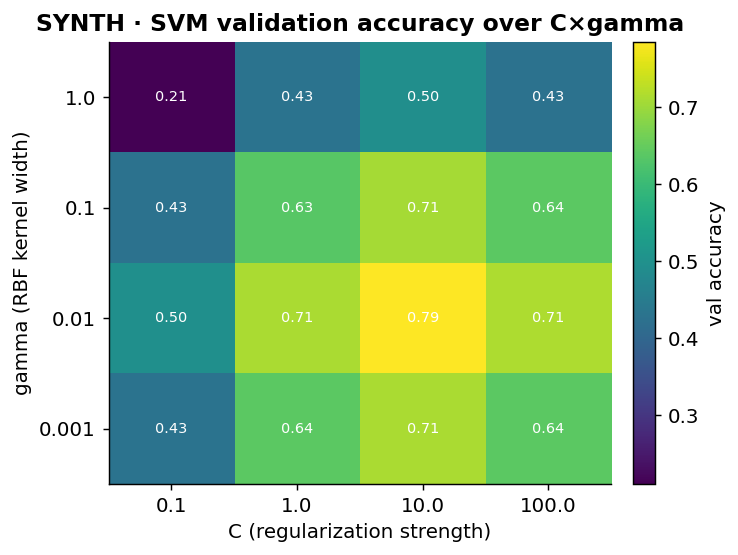

**Feature selection:** correlation drop + ANOVA k-best only (no RFECV/gain/SHAP —
SVC has no `feature_importances_`).

---

### 5.3 Logistic regression — baseline

`LogisticRegression` (`solver="liblinear"`, `class_weight="balanced"`,
`max_iter=2000`) in a `StandardScaler`. A linear log-odds model — the simplest
honest baseline, and the **smoke-test target** (full pipeline in seconds, not
hours). The sigmoid maps the linear score to a class probability:

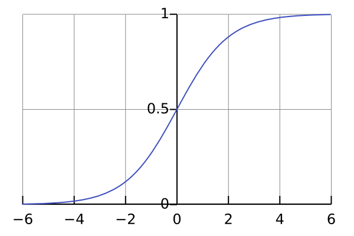

_The logistic (sigmoid) function squashes the linear score `w·x − b` into a
(0,1) probability. Source: Qef, Wikimedia Commons, public domain._

| Hyperparameter | Grid | What tuning it does |
|---|---|---|
| `C` | config (smoke default `{0.1, 1.0}`) | Inverse L2 strength. Low C = strong shrinkage → coefficients pulled toward 0 (more bias, less variance); high C = near-unregularized fit. |
| `penalty` | `l2` (liblinear default) | Regularization type. `liblinear` also supports `l1` for sparse coefficient selection if added to the grid. |
| `class_weight` | `balanced` (fixed) | Re-weights classes inversely to frequency so the minority class isn't ignored. |

**What `C` does to the coefficients** — strong regularization shrinks every
weight toward zero:

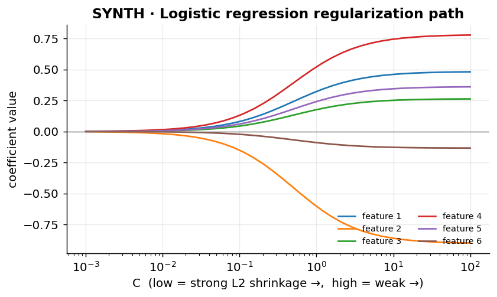

> **Worth noting:** on the *full*-CNV window logistic reaches ~0.65 AUC — tied
> with XGBoost — despite being linear. That says the full-window signal is
> largely linearly separable, which is itself a useful modelling clue.

---

### 5.4 Bidirectional LSTM — deep comparator

A Keras `Sequential` bidirectional LSTM wrapped in `scikeras.KerasClassifier`
so it plugs into the same GridSearchCV loop. Imports are deferred so the package
works without TensorFlow installed.

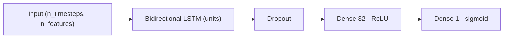
```mermaid
flowchart LR
    I["Input (n_timesteps, n_features)"] --> B["Bidirectional LSTM (units)"]
    B --> D["Dropout"]
    D --> H["Dense 32 · ReLU"]
    H --> O["Dense 1 · sigmoid"]
```

An LSTM cell carries a gated memory state across time, learning which past
information to keep or forget — well suited to a slow, ramping signal like the
CNV:

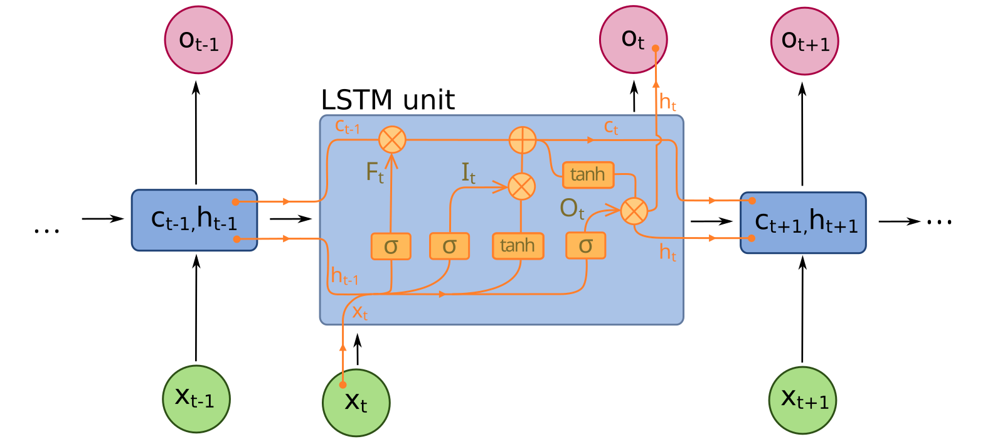

_One LSTM cell with input/forget/output gates. Source: fdeloche, Wikimedia
Commons, CC BY-SA 4.0._

| Hyperparameter | Grid | What tuning it does |
|---|---|---|
| `units` | `32, 64, 128` | Hidden-state width = model capacity. More units = can fit richer temporal patterns but overfits faster on small trial counts. |
| `dropout` | `0.2, 0.4` | Fraction of units zeroed each step. Higher = stronger regularization, smaller train–val gap. |
| `epochs` | `50` | Training passes. Too few underfits; too many overfits (no early stopping here). |
| `batch_size` | `32` | Examples per gradient step. Larger = smoother but coarser updates. |
| `optimizer` / `loss` | `adam` / `binary_crossentropy` (fixed) | Standard adaptive optimizer + log-loss for binary output. |

**Dropout** is the main regularizer for all three neural models — it closes the
train–val gap up to a point, then starts hurting:

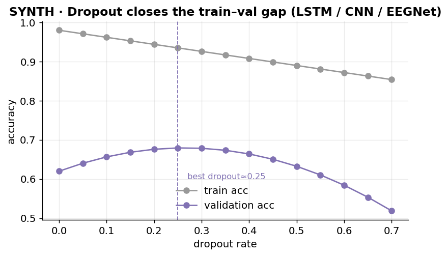

> ⚠️ **Known limitation:** the current driver passes **one timestep per
> feature** (legacy `CNV_LSTM_3.py` behaviour), so the LSTM isn't yet seeing a
> true time sequence. Real per-timestep windowing is a prerequisite before the
> LSTM result means anything — it is **not** in the screening table for this
> reason.

---

### 5.5 Riemannian — covariance comparator

Runs directly on the raw epoch tensor. The intuition: EEG class information
lives in the **spatial covariance** of the signal, and covariance matrices live
on a curved (Riemannian) manifold, so we project them to a flat **tangent space**
before a linear classifier. A strong, well-calibrated family for ERP/SCP shapes
like the CNV.

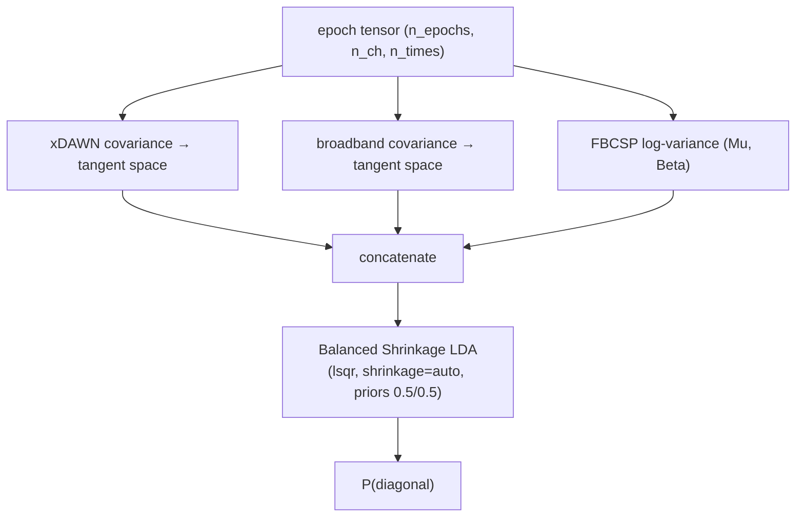
```mermaid
flowchart TB
    X["epoch tensor (n_epochs, n_ch, n_times)"]
    X --> A["xDAWN covariance → tangent space"]
    X --> B["broadband covariance → tangent space"]
    X --> C["FBCSP log-variance (Mu, Beta)"]
    A --> U["concatenate"]
    B --> U
    C --> U
    U --> L["Balanced Shrinkage LDA<br/>(lsqr, shrinkage=auto, priors 0.5/0.5)"]
    L --> P["P(diagonal)"]
```

| Hyperparameter | Grid / default | What tuning it does |
|---|---|---|
| `nfilter` (xDAWN) | `2, 4, 6` | Number of xDAWN spatial filters. More = richer ERP subspace, but more parameters to estimate from few trials. |
| `covariance_estimator` | `oas` (default), `lwf` | Shrinkage covariance estimator. OAS/Ledoit-Wolf both stabilize covariance when channels > trials. |
| `shrinkage` (LDA) | `auto` | Pulls the class covariance toward a scaled identity. Higher shrinkage = stabler, lower-variance discriminant. |
| `fbcsp_bands` | `Mu 8–13`, `Beta 13–30` | Frequency bands for log-variance features (sensorimotor rhythms). |
| `tangent_metric` | `riemann` | Metric for tangent-space projection (geometry of the covariance manifold). |
| window | `full_cnv` (0–2 s) | Covariance structure changes across the whole motor-preparation interval, so the full window is used. |

**Why shrinkage matters here** — with 64 channels and few trials, the raw
covariance is ill-conditioned; shrinkage trades a little bias for a large
stability gain:

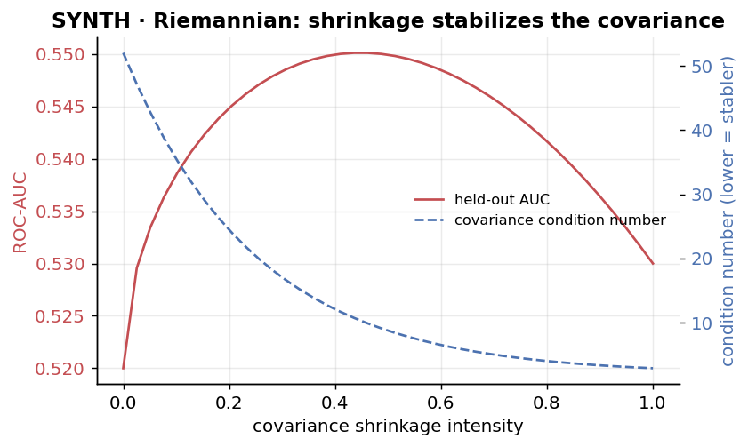

> **Real-data note:** Riemannian is the **only** model that *generalizes*
> (inner-vs-outer gap ~0.04–0.06 vs +0.20–0.29 for the classical models) — but
> its mean AUC never clears ~0.53. Calibrated, but currently flat. Requires the
> optional `riemannian` extra (`pip install -e .[riemannian]`).

---

### 5.6 CNN (EEGNet-lite hybrid)

A compact convolutional net on the raw tensor, **fused** with the XGB-style
tabular branch (including eLORETA source columns). Per-channel
exponential-moving standardization runs inside each fold. `require_source: true`
makes runs fail loudly if source columns are missing.

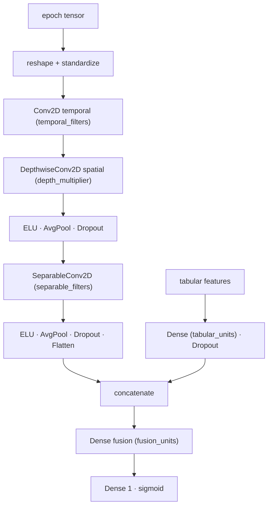
```mermaid
flowchart TB
    T["epoch tensor"] --> R["reshape + standardize"]
    R --> C1["Conv2D temporal (temporal_filters)"]
    C1 --> DW["DepthwiseConv2D spatial (depth_multiplier)"]
    DW --> P1["ELU · AvgPool · Dropout"]
    P1 --> SC["SeparableConv2D (separable_filters)"]
    SC --> P2["ELU · AvgPool · Dropout · Flatten"]
    TB["tabular features"] --> TD["Dense (tabular_units) · Dropout"]
    P2 --> CC["concatenate"]
    TD --> CC
    CC --> FD["Dense fusion (fusion_units)"]
    FD --> O["Dense 1 · sigmoid"]
```

| Hyperparameter | Default | What tuning it does |
|---|---|---|
| `temporal_filters` | `8` | Number of learned temporal frequency filters. More = richer spectral vocabulary. |
| `depth_multiplier` | `2` | Spatial filters learned *per* temporal filter. Controls how many channel-combinations are formed. |
| `separable_filters` | `16` | Filters in the separable temporal block (higher-level temporal features). |
| `temporal_kernel` / `separable_kernel` | `65` / `17` | Receptive-field length in samples. Longer kernels see slower dynamics (good for the slow CNV). |
| `pool_1` / `pool_2` | `4` / `8` | Temporal downsampling. More pooling = coarser time, fewer params, less overfit. |
| `dropout` | `0.5` | Regularization strength (see dropout curve in §5.4). |
| `l2` | `1e-4` | Weight decay on conv/dense kernels. |
| `learning_rate` | `1e-3` | Adam step size. |
| `tabular_units` / `fusion_units` | `32` / `32` | Width of the tabular branch and the post-fusion layer. |
| `epochs` / `batch_size` | `30` / `16` | Training budget; early stopping (`patience 8`, `val_split 0.2`) guards overfit. |

> **Real-data note:** CNN diagnostics run on the **late** window (1–2 s) and sit
> at ~0.45–0.63 baseline AUC. Its time-occlusion map (see §7) shows the early
> part of the late window carries the most information.

---

### 5.7 EEGNet (hybrid)

A faithful local implementation of the **EEGNet** block (Lawhern et al., 2018):
the same temporal → depthwise-spatial → separable-temporal structure as the CNN
above, but with EEGNet's signature **max-norm weight constraints** (depthwise
`max_norm=1.0`, dense `max_norm=norm_rate`) instead of L2, and it runs on the
**full** 0–2 s window. Same hybrid fusion of tensor + tabular branches.

| Hyperparameter | Default | What tuning it does |
|---|---|---|
| `f1` | `8` | Temporal filters (EEGNet's F1). Spectral capacity of the first block. |
| `depth_multiplier` (D) | `2` | Spatial filters per temporal filter. EEGNet's depth parameter. |
| `f2` | `16` | Pointwise filters in the separable block (EEGNet's F2 ≈ F1·D). |
| `kernel_length` | `64` | Temporal kernel of the first conv ≈ half the sampling rate (captures ~2 Hz dynamics). |
| `separable_kernel_length` | `16` | Temporal kernel of the separable block. |
| `dropout_rate` | `0.5` | Regularization (EEGNet uses 0.5 for within-subject). |
| `norm_rate` | `0.25` | Max-norm constraint on the classifier weights — EEGNet's main regularizer. |
| `learning_rate` | `1e-3` | Adam step size. |
| `epochs` / `batch_size` | `50` / `16` | Training budget; early stopping `patience 10`. |

> **Real-data note (important):** the EEGNet starter ran on the **full** window
> and posts the **highest single-subject baseline AUCs in the project** — up to
> **0.94 (P13)** and **0.82 (P15)**, cohort baseline often 0.6–0.7. This is the
> strongest neural signal so far and reinforces the full-window finding. See the
> CNN-vs-EEGNet comparison in §7.

---

### 5.7b EEGNet — PyTorch port (`eegnet_torch`)

A layer-for-layer PyTorch port of §5.7, registered as its own model
(`--model eegnet_torch` / `--speed-tier eegnet_torch`; `configs/eegnet_torch.yaml`
clones `configs/eegnet.yaml`). The Keras `eegnet` is untouched — it produced the
recorded results. The port is a plain `torch.nn.Module` (`EEGNetTorch`) whose
`forward` takes `(batch, n_channels, n_times)`, braindecode's input convention,
so a braindecode/eegdash training loop could take the module as it is (not
exercised here) — wrapped in a hand-rolled scikit-learn estimator (`EEGNetTorchClassifier`) so it
runs as-is under the nested-CV driver's GridSearchCV and
`scripts/08_tensor_model_diagnostics.py`. CPU only, and it imports neither
skorch nor TensorFlow. It does not import braindecode either; the fold-local
standardizer it reuses from `cnn.py` calls braindecode's
`exponential_moving_standardize` when that package is installed, exactly as the
Keras path does.

| Aspect | Keras original | Port |
|---|---|---|
| Layer stack | temporal conv → BN → depthwise spatial → BN → ELU → pool 4 → dropout → separable conv → BN → ELU → pool 8 → dropout → flatten (+ tabular/fusion branch) → 1 sigmoid unit | identical order and shapes |
| Max-norm | `max_norm(1.0)` on the depthwise kernel, `max_norm(norm_rate)` on fusion + classifier (Keras `axis=0`) | PyTorch has no constraint API, so the port re-applies Keras's formula over the same axes **after every optimizer step** |
| "same" padding | TF puts an even kernel's extra sample on the right | explicit `ZeroPad2d` with the same split |
| Flatten order | channels-last | permuted to channels-last before flattening |
| Initialisation | `glorot_uniform` | same limits, including Keras's depthwise fan convention |
| BatchNorm | momentum 0.99, ε 1e-3 | momentum 0.01 (PyTorch spelling of the same decay), ε 1e-3 |
| Optimiser / loss | Adam (ε 1e-7); BCE + L2(1e-4) on the tabular dense kernel | same, and the L2 term is in the validation loss too, as Keras reports it |
| Training | 50 epochs, batch 16, `validation_split=0.2`, EarlyStopping(`val_loss`, patience 10, `restore_best_weights`) | same, including Keras 3 restoring the best epoch even when training is not cut short |
| Standardisation | per-channel exponential-moving, inside each fold | the same transformer, routed by `normalization.py` |
| Seeding | scikeras is left unseeded | torch and numpy seeded from `modeling.random_state` |

**Inherited behaviour, deliberately reproduced.** Keras takes `validation_split`
from the *trailing* fraction of the training fold, before shuffling. The epoch
tensor is stacked One-then-Two and scikit-learn returns sorted fold indices, so
that tail is almost entirely `Two` — early stopping watches a single-class
validation set. The port reproduces this for parity; changing it would change
the Keras models' behaviour too, so it is left as a separate decision.

**Parity tests** (`tests/test_eegnet_torch.py`): trainable and non-trainable
parameter counts against constants recorded from the Keras model (six shapes,
including the real 64 × 2049 tensor) *and* against a live Keras build; a forward
pass with the Keras weights copied in, agreeing to `atol=1e-5`; the max-norm
helper against Keras's own `MaxNorm`; the bound still holding after real
training steps, with a control that fails if the constraint call is removed; the
validation-split and early-stopping semantics; the sklearn wrapper on synthetic
fixtures; and an end-to-end `--model eegnet_torch` run of `scripts/04_train.py`
on `configs/smoke.yaml` plus the overlay. **The live Keras-vs-PyTorch tests run
only where TensorFlow is installed (`.venv312`); they skip in CI and in the
Docker image, neither of which installs TensorFlow.** The recorded-constant
tests cover those environments.

**On real data: a one-subject sanity check, not a parity claim.**

| P13, `--speed-tier`, 2 outer folds × 1 repeat, full-CNV window | fold AUCs | mean AUC | wall time |
|---|---|---|---|
| `eegnet` (Keras) | 0.690 / 0.540 | 0.615 | 59 s |
| `eegnet_torch` | 0.638 / 0.548 | 0.593 | 34 s |

Same participant, same inputs (80 epochs × 64 channels × 2049 samples, plus
25,857 tabular features of which 4,800 are source-space), same CV and grid, run
back to back in `.venv312` on 2026-09-14. One subject and two folds cannot
establish equivalence, and this is not offered as one: the two recorded Keras
EEGNet cohort runs put P13 at **0.44** (2026-05-29) and **0.615** (2026-05-30)
under the same config, because scikeras is unseeded — a run-to-run spread wider
than the gap between the two models above. Read it as "the port trains and
scores in the same range on real data", nothing more. It has not been run on any
other participant.

> **Note on the 0.94 quoted in §5.7 and §7.** That figure is the `baseline_auc`
> of `scripts/08_tensor_model_diagnostics.py`, which refits on *all* of a
> participant's epochs and then scores those same epochs — the script says so
> itself ("not a held-out performance estimate"). It is an in-sample fit, not a
> held-out result. The held-out nested-CV numbers for P13 are the ones in the
> table above.

---

### 5.8 EEGNeXt — sophisticated hybrid CNN

A more sophisticated CNN built on the EEGNet-lite block, for when the compact
`cnn`/`eegnet` comparators leave signal on the table. It keeps the hybrid
tensor + tabular fusion and the full-CNV window, but upgrades the convolutional
core in three ways — each chosen for the CNV's slow, multi-rhythm character.

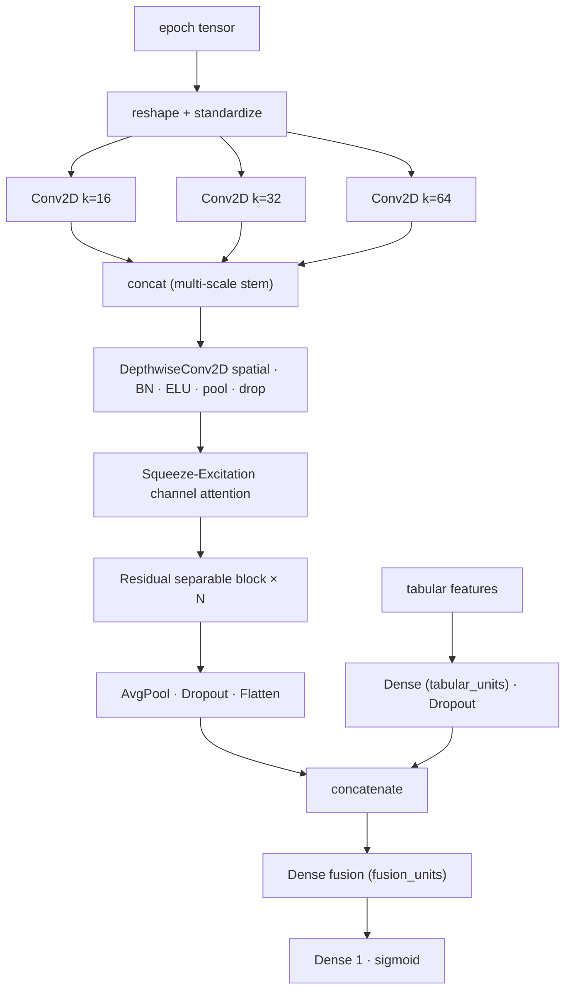
```mermaid
flowchart TB
    T["epoch tensor"] --> R["reshape + standardize"]
    R --> M1["Conv2D k=16"]
    R --> M2["Conv2D k=32"]
    R --> M3["Conv2D k=64"]
    M1 --> CC["concat (multi-scale stem)"]
    M2 --> CC
    M3 --> CC
    CC --> DW["DepthwiseConv2D spatial · BN · ELU · pool · drop"]
    DW --> SE["Squeeze-Excitation channel attention"]
    SE --> RB["Residual separable block × N"]
    RB --> P2["AvgPool · Dropout · Flatten"]
    TB["tabular features"] --> TD["Dense (tabular_units) · Dropout"]
    P2 --> FC["concatenate"]
    TD --> FC
    FC --> FD["Dense fusion (fusion_units)"]
    FD --> O["Dense 1 · sigmoid"]
```

1. **Multi-scale temporal stem** — parallel temporal convolutions at several
   kernel lengths, concatenated, so δ/θ/α/β timescales are captured at once.
2. **Squeeze-and-Excitation channel attention** — a gating branch reweights
   feature maps by global informativeness, suppressing uninformative filters.
3. **Residual separable blocks** — depth via separable convs in skip
   connections, so the network deepens without the usual optimisation cost on
   small per-participant data.

| Hyperparameter | Default | What tuning it does |
|---|---|---|
| `temporal_kernels` | `[16, 32, 64]` | Kernel lengths of the parallel temporal branches. More/longer kernels = wider range of rhythms captured per layer (the core "multi-scale" knob). |
| `f1` | `8` | Filters **per** temporal branch. Spectral capacity of the stem. |
| `depth_multiplier` (D) | `2` | Spatial filters learned per temporal filter (EEGNet's depthwise depth). |
| `f2` | `32` | Filters in each separable/residual block — higher-level temporal capacity. |
| `separable_kernel` | `16` | Temporal kernel inside the residual separable blocks. |
| `n_residual_blocks` | `2` | How many residual separable blocks to stack = network depth. More = higher capacity, more overfit risk. |
| `se_ratio` | `4` | Squeeze-Excitation reduction ratio. Smaller = a larger attention bottleneck (more expressive gating, more params). |
| `dropout` | `0.5` | Regularization across conv and fusion blocks (see dropout curve in §5.4). |
| `norm_rate` | `0.25` | Max-norm constraint on the dense/classifier weights — EEGNet-style regularizer. |
| `l2` | `1e-4` | Weight decay on the conv/dense kernels. |
| `learning_rate` | `1e-3` | Adam step size. |
| `tabular_units` / `fusion_units` | `32` / `32` | Width of the tabular branch and the post-fusion layer. |
| `epochs` / `batch_size` | `60` / `16` | Training budget; early stopping `patience 12`, `val_split 0.2`. |

The **multi-scale + attention + depth** combination is the most expressive model
in the roster. The trade-off is data hunger: with few trials per participant,
lean on `dropout`, `norm_rate`, and a shallow `n_residual_blocks` first, then add
capacity (more `temporal_kernels`, deeper residual stack) only if the held-out
AUC keeps up.

> **Status:** new (2026-06-08). Registered as `--model eegnext` /
> `--speed-tier eegnext` (`configs/eegnext.yaml`); statically verified (imports,
> registry, config, test suite) but **not yet run** — the neural fit needs the
> `lstm`/TensorFlow extra, which isn't installed in the current environment.

---

### 5.9 Shrinkage-LDA CNV benchmark

An opt-in, deliberately minimal ERP baseline: the `cnv_benchmark` feature block
computes **250 ms mean-amplitude bins** over the **9 medial motor channels**
(`Cz, FCz, CPz, C1, C2, FC1, FC2, CP1, CP2`), fed to a shrinkage LDA. It exists
to answer "how much can a textbook CNV-amplitude reading alone get us?" before
crediting any complex model.

| Hyperparameter | Default | What tuning it does |
|---|---|---|
| `bin_n` | `0.25 s` | Averaging window per bin. Wider = smoother, fewer features; narrower = more temporal detail. |
| `channels` | 9 medial motor | The ROI. Restricting to motor cortex tests the foot-motor-preparation hypothesis directly. |
| `shrinkage` | `auto` | LDA covariance shrinkage (stability vs bias, as in §5.5). |
| `enabled` | `false` | Off by default — add `cnv_benchmark` to `features.blocks` to emit it. |

> **Status:** scaffolded, not yet run as a benchmark. Cheap to add and a good
> "floor" reference for every other model.

---

## 6. Tuning machinery shared across models

Beyond per-model knobs, four cross-cutting controls shape every run.

**Nested cross-validation** (`modeling.cv`): outer `RepeatedStratifiedKFold`
(5 splits × 20 repeats by default) with an inner `StratifiedKFold` (3 splits)
for the hyperparameter search. A no-shuffle chronological check runs alongside
to catch temporal leakage. The recorded screening and binning runs in §7 used
the **express** tier instead: 5 splits × 2 repeats, 2 inner folds.

The inner search scores **accuracy** unless `modeling.scoring` is set, and no
committed config sets it (`_make_search_cv`, `src/eeg_steptype/models/train.py:791`).
Every binary inner-vs-outer gap in this document is therefore inner accuracy
minus held-out AUC (or minus held-out accuracy for the screening D4 column).

**Search method** (`modeling.search.method`): one knob controls the search for
every model.

| `method` | XGBoost | All other models |
|---|---|---|
| `auto` (default) | `HalvingRandomSearchCV` (halving on `n_estimators`) | `GridSearchCV` |
| `grid` | `GridSearchCV` | `GridSearchCV` |
| `random` | `RandomizedSearchCV` | `RandomizedSearchCV` |
| `halving_random` | `HalvingRandomSearchCV` | grid (auto-fallback — no `n_estimators` resource) |

`random` samples `n_iter` (default 100) configurations from each grid for **every**
model, capped at the grid size. Note it drops XGB's successive-halving speedup,
so each XGB candidate trains the full `n_estimators` trees.

**Speed tiers** trade wall-time for thoroughness by trimming the grid, CV
repeats, and prune passes. Rough ladder (see `configs/README.md`):

| Tier | Use | Relative cost |
|---|---|---|
| `lightning` | single-participant smoke / iteration | lowest |
| `quick` / `express` | cohort screening (the screening results use **express**) | medium |
| `default` | full publication run | highest (hours) |
| `riemannian`, `cnn`, `eegnet`, `eegnext` | model-specific overlays (set window, input path, source requirement) | varies |

**Feature-selection toggles** (XGB path) — each can be switched off to isolate
its effect:

| Key | Default | Effect when `false` |
|---|---|---|
| `modeling.rfecv.enabled` | legacy | Skip iterated RFECV. |
| `modeling.gain_prune.enabled` | `true` | Skip gain-prune subset + refit. |
| `modeling.shap_prune.enabled` | derived | Skip SHAP-prune subset + refit. |
| `modeling.feature_selection.method` | `stability` | `rfecv` (legacy) or `none`. |

**Cross-subject pooling** (`models/pooling.py`, `scripts/09_pooling_comparison.py`,
`configs/pooling_compare.yaml`): three training workflows that reuse the
**exact** in-fold feature-selection funnel and nested hyperparameter search from
`train.py`, differing only in how data is shared across subjects. Supported for
all tabular models (`xgb`, `svm`, `logistic`).

| Mode | Training data for held-out subject *s* | Test set | Question answered |
|---|---|---|---|
| `per_participant` | *s*'s own training split only (~64 epochs) | *s*'s held-out fold | within-subject only (the per-participant baseline) |
| **`partial`** | *s*'s training split **+ all other subjects** | *s*'s held-out fold | global prior + local adaptation (**recommended**) |
| **`full`** | **all other subjects only** | all of *s* | pure cross-subject transfer (leave-one-subject-out) |

`per_participant` and `partial` share **identical test folds**, so their
difference is a clean paired estimate of what pooling buys. Both pooled modes
use **subject-grouped inner CV** (via `groups` threaded into
`train._fit_score_split`) so the hyperparameter search never peeks across the
train/test subject boundary — without this, the inner score would itself be
optimistic and defeat the purpose.

Run the three-way comparison:

```bash
python scripts/09_pooling_comparison.py --config configs/pooling_compare.yaml
# Writes outputs/runs/pooling_compare_<id>/pooling_summary.csv
```

---

## 7. Real results so far

_Source: `outputs/screening/` (runs 2026-05-14 → 2026-05-29, `scripts/06_compare_runs.py`)
and `outputs/diagnostics/` (CNN/EEGNet occlusion starters).
Pooling: `outputs/runs/pooling_compare_demo/` (2026-06-10, `scripts/09_pooling_comparison.py`).
AUC 0.50 = chance._

### Diagnostic 1 — mean test AUC ± fold-level 95% CI (early cohort, n=8, late window)

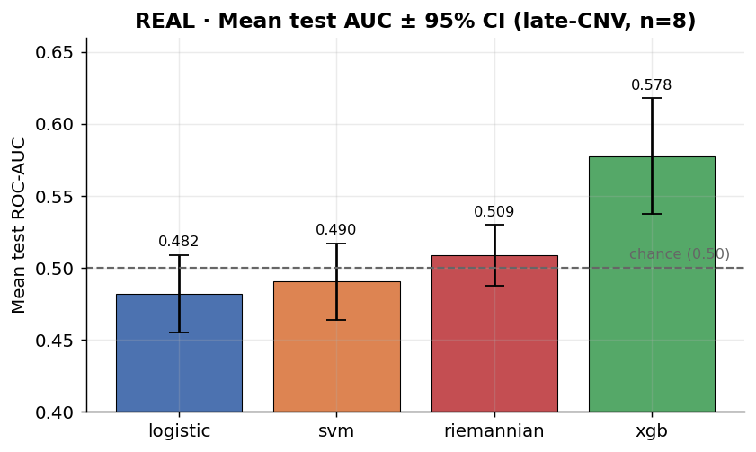

XGBoost (0.578) is the only model clearly above chance on the late window; the
classical linear/kernel models hover near 0.49. The error bars are fold-level
(1.96 · SD / √n over CV folds), which is narrower than a participant-level
interval — see [README — Confidence intervals](README.md#confidence-intervals).

### The window effect — the headline result


Same binning recipe, same 20-participant cohort, late vs full window. **Full CNV
lifts logistic by +0.20 and XGB by +0.09 AUC** (XGB 0.568 → 0.655, `rich_mean_0125`)
— bigger than any tuning effect observed. Riemannian is the exception (it's tuned for the full-window covariance
already and does *worse* on this recipe).

### Per-participant heterogeneity (n=8)

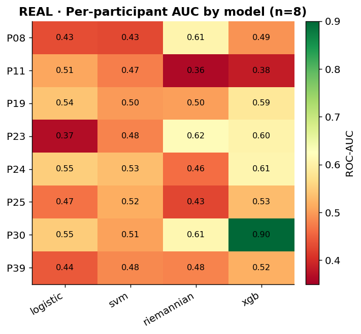

Signal is concentrated in a few subjects — **P30** is XGB's standout (0.90), while
**P08/P11** are hard for every classical model (Riemannian is often their best).
Scattered rankings → per-participant model selection or an ensemble may beat one
global model.

### Hybrid neural baselines — CNN (late) vs EEGNet (full)

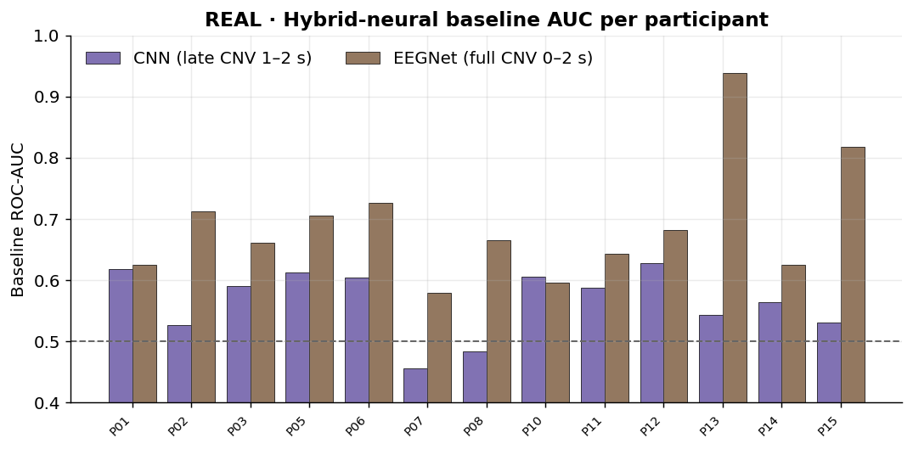

The full-window EEGNet baseline beats the late-window CNN baseline for **most
participants**, and reaches 0.94 on P13 (an **in-sample** diagnostic fit — see
§5.7b) — independent corroboration of the
window effect from a completely different model family.

### CNN time-occlusion — which moments matter

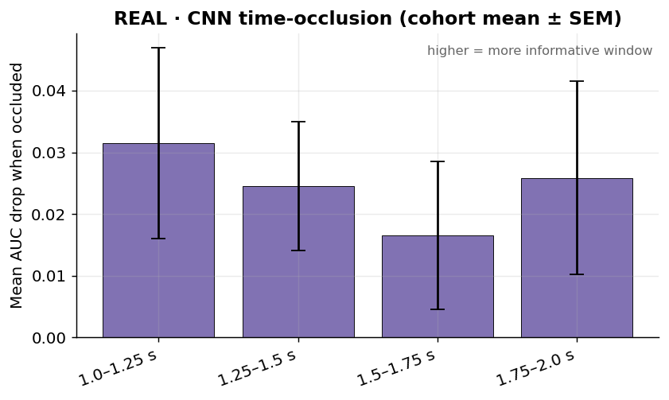

Occluding each 250 ms slice and measuring the AUC drop: within the late window,
the **earlier slices (1.0–1.5 s)** are the most informative on average — another
hint that the discriminative signal starts before the late window even opens.

### Pooling comparison — attacking the inner-vs-outer gap

`xgb`, 8-subject subset (P30, P02, P15, P13, P25, P07, P12, P08), reduced
~2.3k-feature set (`amplitude` + `slopes` blocks only, `bin_widths=[0.25, 0.5]`)
for tractability. Source: `outputs/runs/pooling_compare_demo/pooling_summary.csv`.
Reproduce: `python scripts/09_pooling_comparison.py --config configs/pooling_compare.yaml`.

| mode | folds | held-out AUC | inner-CV accuracy | **gap (inner acc − outer AUC)** |
|---|---|---|---|---|
| `per_participant` (baseline) | 32 | 0.567 | 0.744 | **+0.177** |
| `full` (leave-subject-out) | 8 | 0.626 | 0.611 | **−0.015** |
| `partial` (prior + local) | 32 | **0.673** | 0.637 | **−0.036** |

**Both goals achieved at once:**
- **The gap collapses** from **+0.177 to ≈0**. With ~1.5k pooled epochs the
  subject-grouped inner CV is stable and, if anything, mildly *conservative*
  vs the held-out fold — the honest direction.
- **Held-out AUC rises.** `partial` shares the baseline's exact test folds, so
  its **+0.106 AUC** (0.567 → 0.673) is a clean paired gain; `full` (no target
  data at all) still beats the baseline at 0.626.

Caveat: 8 subjects + reduced features make per-subject AUC noisy
(`test_auc_sd ≈ 0.19`); the gap-collapse and partial-pooling lift are the robust
takeaways.

**Confirmed on the full 20-subject cohort** (`r1_pool_confirm20`, same reduced ~2.3k-feature
fast set and 4-fold CV): `per_participant`
0.5646 (gap +0.173), **`partial` 0.5957 (gap −0.014)**, `full` 0.5882 (gap −0.012).
The **gap collapse reproduces robustly**; the AUC lift shrinks from +0.106 (8-subj) to
**+0.031 paired** (t=1.27, n = 20, reduced feature set, n.s.) at cohort scale — real but modest. Promoted as the
one-line opt-in `modeling.pooling.mode: partial` (committed overlay
[`configs/pooling.yaml`](configs/pooling.yaml); global default stays `per_participant`).
A follow-on 4-round perf loop found no further XGB win — looser funnel, richer search, and
Legendre shape features are all null at cohort scale (see
[`outputs/perf_loop/SUMMARY.md`](outputs/perf_loop/SUMMARY.md)).

**Confirmed on the RICH feature set** (rich-pooling sub-loop, `r_rich_conf20`, 20 subjects,
`amplitude0.125+slopes+psd` ≈ 9.7k cols = recorded rich recipe minus `src`+`cnv_benchmark`;
a new `modeling.pre_kbest` ANOVA pre-filter before the correlation drop makes it tractable):
`per_participant` 0.5990 (gap +0.198), **`partial` 0.6376 (gap −0.039)** — paired **+0.0386
AUC** (t=1.17, n = 20, rich set, n.s.) and the **gap collapses +0.198 → −0.039**. vs the recorded rich
per-participant **0.655 / +0.169** (5×2 express CV) the pooled 0.6376 is ~flat (within noise) but **honest** —
pooling makes the project's best-AUC region trustworthy. Same pattern as the fast set, now at
the higher rich operating point; the two levers are largely complementary. Recommended config
[`configs/pooling_rich.yaml`](configs/pooling_rich.yaml); write-up in
[`outputs/perf_loop/RICH_POOLING_SUMMARY.md`](outputs/perf_loop/RICH_POOLING_SUMMARY.md).

> Full rationale and all non-pooling gap remedies (CV restructuring, grid
> regularization, feature-funnel tightening, metric alignment, calibration) are
> in [`docs/OVERFITTING_GAP_SOLUTIONS.md`](docs/OVERFITTING_GAP_SOLUTIONS.md).

### The five screening diagnostics, summarized

| Diagnostic | What it measures | Finding |
|---|---|---|
| D1 — mean AUC ± CI (fold-level) | accuracy | XGB best (0.568 late / 0.655 full, same recipe, n = 20); others near chance late. |
| D2 — tier-response slope | does more budget help? | Only XGB has positive slope (+0.016); logistic/SVM flat (near ceiling). |
| D3 — across-fold variance | stability | Moderate & similar (~0.10–0.16 SD); SVM most volatile. |
| D4 — inner-vs-outer gap | overfitting | Classical models overfit (+0.20–0.29, inner − outer accuracy); Riemannian generalizes (~0.05). Pooling collapses the XGB gap (inner accuracy − outer AUC) to ≈0. |
| D5 — per-participant ranking | homogeneity | XGB most rank-1 finishes; rankings scattered → heterogeneous signal. |

---

## 8. Decision support — recommended next steps

Ordered by expected payoff (synthesized from the diagnostics above and
`outputs/screening/SCREENING_SUMMARY_2026-05-29.md`):

1. **Resolve the window question first.** Full CNV (0–2 s) is already the
   default primary window (`configs/default.yaml`, `prediction_windows.primary`).
   What remains is to confirm that its advantage isn't a leakage or labelling
   artifact. This is the single highest-leverage check; it dwarfs tuning.
2. **Close the inner-vs-outer gap.** The structural fix is now implemented and
   validated: **`partial` pooling** collapses the gap to ≈0 and raises held-out
   AUC (+0.106 on the 8-subject demo; +0.031 fast set and +0.0386 rich set at
   n = 20, neither significant — see §7); also consider the within-design fixes documented in
   [`docs/OVERFITTING_GAP_SOLUTIONS.md`](docs/OVERFITTING_GAP_SOLUTIONS.md) (metric
   alignment, grid regularization, funnel tightening) as complementary levers.
3. **Center tuning on XGBoost.** It has the best AUC, the only non-flat tier
   slope, and the most rank-1 finishes. Deprioritize logistic/SVM tuning on the
   late window (flat and below chance there).
4. **Complete the partial full-CNV runs.** `bin_full_cnv_stats_pyramid_core` has
   SVM on only 7 participants — run logistic/XGB on the full cohort to make the
   full-window comparison apples-to-apples.
5. **Try per-participant model selection / ensembling.** The scattered D5
   rankings and the heatmap say one global model is leaving signal on the table.
6. **Make the deep models real comparators:** give the **LSTM true per-timestep
   windowing** (there is no LSTM result yet — it was left out of screening
   because the driver feeds one timestep per feature), and scale the
   **EEGNet starter to the full cohort** given its strong single-subject AUCs.
7. **Run the shrinkage-LDA CNV benchmark** as a cheap floor — if a 9-channel ERP
   reading matches a tuned XGB, that reframes the whole modelling effort.
8. **Benchmark the new EEGNeXt model** against the EEGNet starter (it runs in
   `.venv312`, which has TensorFlow 2.21; not run yet). Its multi-scale + attention + residual design
   targets exactly the EEGNet headroom; confirm it actually converts that
   capacity into held-out AUC rather than overfitting the small trial counts.

### Which model deserves investment?

| Question | If **yes** → | If **no** → |
|---|---|---|
| Need interpretable feature importances? | XGBoost (gain/SHAP) | EEGNet / CNN |
| Want calibrated probabilities now? | Riemannian (but low AUC) | tune XGB calibration |
| Is the signal linear (full window)? | Logistic is competitive & cheap | keep XGB/neural |
| Enough trials for deep nets? | EEGNet (full window) | classical + stability selection |
| Gap between inner CV and held-out AUC? | `partial` pooling (implemented) | within-design grid / funnel fixes |

---

## 9. Progress tracker

**Legend:** ✅ done · 🟡 in progress / partial · ⚪ scaffolded, not run · ⬜ not started

| Area | Item | Status |
|---|---|---|
| Pipeline | Preprocess → src → features → train → visualize | ✅ |
| Pipeline | Window-aware feature caching (late / full) | ✅ |
| Models | XGBoost primary path (halving search, gain/SHAP prune) | ✅ |
| Models | SVM / Logistic comparators | ✅ |
| Models | Riemannian (xDAWN + TS + FBCSP → LDA) | ✅ scaffolded · 🟡 screened |
| Models | CNN hybrid (tensor + tabular) | 🟡 starter diagnostics only |
| Models | EEGNet hybrid | 🟡 starter diagnostics only |
| Models | EEGNet PyTorch port (`eegnet_torch`) | ✅ implemented + parity-tested · 🟡 one-subject sanity run (P13) |
| Models | EEGNeXt (multi-scale + SE + residual hybrid) | ✅ implemented + wired · ⚪ not yet run (runs in `.venv312`, which has TF) |
| Models | BiLSTM with **true per-timestep windowing** | ⬜ blocked on windowing |
| Models | Shrinkage-LDA CNV benchmark | ⚪ enabled flag off |
| Pooling | `models/pooling.py` — per / partial / full workflows | ✅ implemented |
| Pooling | `scripts/09_pooling_comparison.py` — three-way comparison script | ✅ |
| Pooling | `configs/pooling_compare.yaml` — 8-subject / reduced-features config | ✅ |
| Pooling | 8-subject demo run (pooling_compare_demo) | ✅ gap validated |
| Pooling | Full-cohort pooling confirms (fast `r1_pool_confirm20`, rich `r_rich_conf20`) | ✅ gap collapse confirmed; AUC lift n.s. |
| Screening | 4-model express screen (n=8, n=11) | ✅ |
| Screening | Late-vs-full window comparison | ✅ headline result |
| Screening | Full-CNV cohort for all classical models | 🟡 SVM-only partial run remains |
| Analysis | Confirm window effect is not leakage | ⬜ |
| Analysis | Inner-vs-outer gap — structural fix (pooling) | ✅ validated on 8-subject demo and 20-subject confirms |
| Analysis | Inner-vs-outer gap — within-design fixes (§2–§5 of OVERFITTING_GAP_SOLUTIONS.md) | ⬜ |
| Analysis | Per-participant selection / ensembling | ⬜ |
| Analysis | Sliding-window AUC time-course | ⚪ configured, not run |
| Docs | `docs/OVERFITTING_GAP_SOLUTIONS.md` — gap-remediation guide | ✅ |
| Tests | `tests/test_pooling.py` — pooling data-sharing semantics | ✅ |
| Tests | `tests/test_eegnet_torch.py` — Keras-parity + wrapper + end-to-end | ✅ |
| Infra | Dockerfile + GitHub Actions CI (ruff, pytest, suite in the container) | ✅ |

---

## Appendix A — hyperparameter grid reference

Verbatim from `configs/default.yaml` (`modeling:` block) — the search spaces the
screening runs actually used.

```yaml
xgb.param_grid:
  max_depth:         [2, 4, 8, 16]
  min_child_weight:  [1]
  reg_alpha:         [0, 0.1, 0.5]
  gamma:             [0, 0.1, 0.3, 0.5, 1, 2]
  reg_lambda:        [1, 3, 5, 10]
  colsample_bytree:  [0.6, 0.7]
  colsample_bylevel: [0.6, 0.8]
  learning_rate:     [0.01, 0.03, 0.05]
  subsample:         [0.6, 0.8, 1.0]

svm.param_grid:
  C:      [0.1, 1.0, 10.0, 100.0]
  gamma:  [scale, auto, 0.001, 0.01, 0.1, 1.0]
  kernel: [rbf, linear, poly]
  degree: [2, 3, 4]

lstm:
  units_grid:   [32, 64, 128]
  dropout_grid: [0.2, 0.4]
  epochs: 50
  batch_size: 32

riemannian:
  covariance_estimator: oas          # grid also sweeps lwf
  xdawn.nfilter: 4                    # grid sweeps [2, 4, 6]
  fbcsp_bands: { Mu: [8, 13], Beta: [13, 30] }

cnn / eegnet:                         # defaults; param_grid overridable per config
  temporal_filters/f1: 8
  depth_multiplier: 2
  separable_filters/f2: 16
  dropout(_rate): 0.5
  learning_rate: 1e-3

eegnet_torch:                         # configs/eegnet_torch.yaml; PyTorch port
  # Same defaults and single-candidate grid as eegnet above, with scikeras's
  # model__ prefix dropped (f1, depth_multiplier, f2, kernel_length, ...).

eegnext:                              # configs/eegnext.yaml; sophisticated CNN
  temporal_kernels: [[16, 32, 64]]    # multi-scale temporal stem
  f1: 8                               # filters per temporal branch
  depth_multiplier: 2
  f2: 32                              # separable / residual-block filters
  separable_kernel: 16
  n_residual_blocks: 2                # residual separable depth
  se_ratio: 4                         # squeeze-excitation reduction
  dropout: [0.25, 0.5]
  norm_rate: 0.25
  learning_rate: 1e-3

# Pooling comparison overlay (configs/pooling_compare.yaml):
#   participants: [P30, P02, P15, P13, P25, P07, P12, P08]  # 8-subject demo subset
#   features.blocks: [amplitude, slopes]                      # ~2.3k cols (tractable)
#   modeling.cv.n_splits: 4, n_repeats: 1, inner_splits: 2
#   modeling.search.n_iter: 8, halving.max_resources: 160
#   modeling.feature_selection.method: stability, max_features: 40
```

Search controls: `cv = RepeatedStratifiedKFold(5×20)`, inner `StratifiedKFold(3)`
(default tier; the recorded screening/binning runs used express, 5×2 with 2 inner folds).
`modeling.search.method` selects the searcher for all models — `auto`
(`HalvingRandomSearchCV` for XGB with resource `n_estimators` 100→1000 factor 3,
`GridSearchCV` otherwise), `grid`, `random` (`RandomizedSearchCV` everywhere,
`n_iter=100`), or `halving_random`.

## Appendix B — figure provenance & licenses

| Figure | Kind | Source |
|---|---|---|
| `real_*.png` | **Real repo data** | `outputs/screening/*.md`, `outputs/diagnostics/*/participant_summary.csv` + `time_occlusion.csv` |
| `synth_*.png` | **Illustrative (made-up)** | generated by `docs/make_models_figs.py` to show the *shape* of a tuning effect — not project results |
| `wiki_svm_margin.png` | Reference diagram | Larhmam, [Wikimedia Commons](https://commons.wikimedia.org/wiki/File:SVM_margin.png), CC BY-SA 4.0 |
| `wiki_lstm_cell.svg` | Reference diagram | fdeloche, [Wikimedia Commons](https://commons.wikimedia.org/wiki/File:Long_Short-Term_Memory.svg), CC BY-SA 4.0 |
| `wiki_logistic_curve.svg` | Reference diagram | Qef, [Wikimedia Commons](https://commons.wikimedia.org/wiki/File:Logistic-curve.svg), public domain |

**Regenerate all data/illustrative figures:**

```bash
.venv/Scripts/python.exe docs/make_models_figs.py   # writes docs/models_figs/*.png
```

The two `wiki_*` reference diagrams are external assets (kept under
`docs/models_figs/`); they are not produced by the script.
