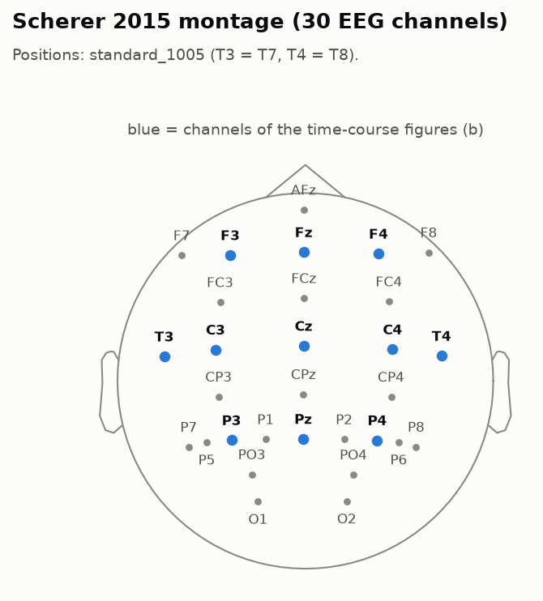
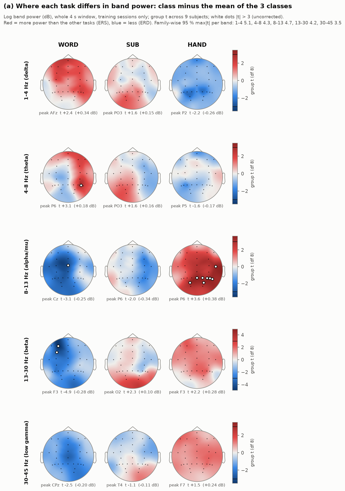
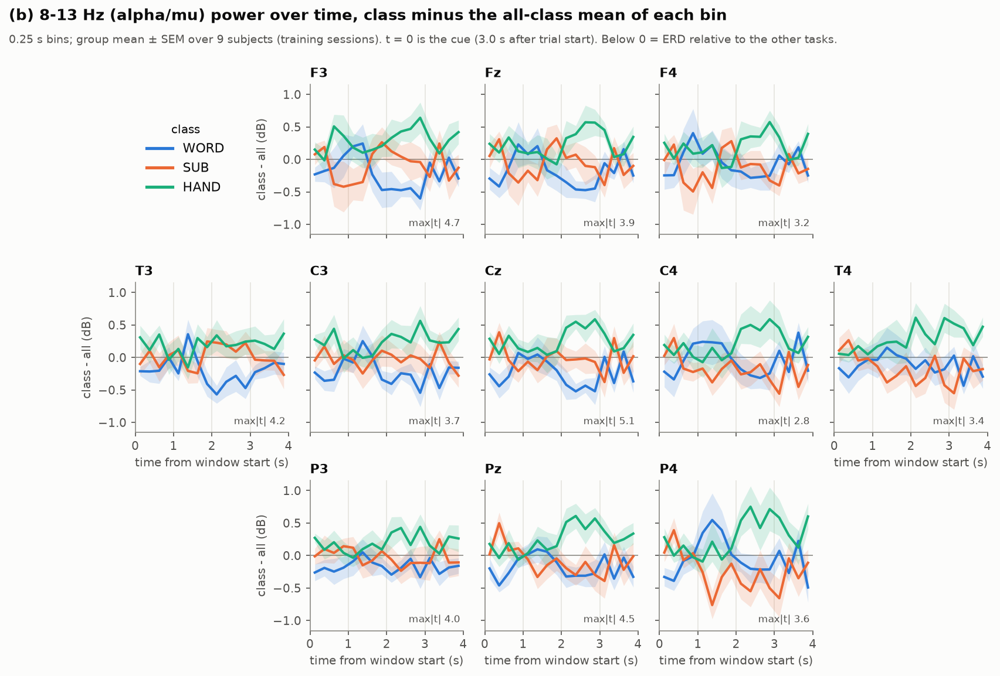
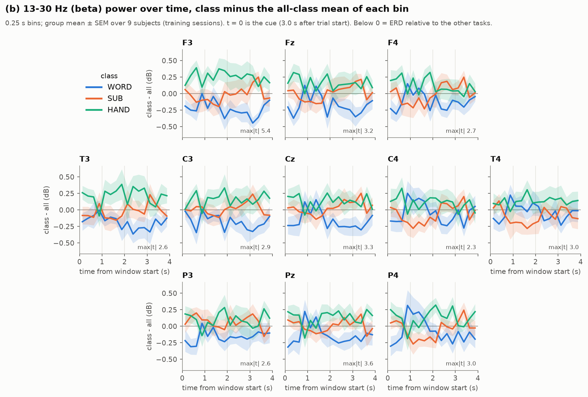
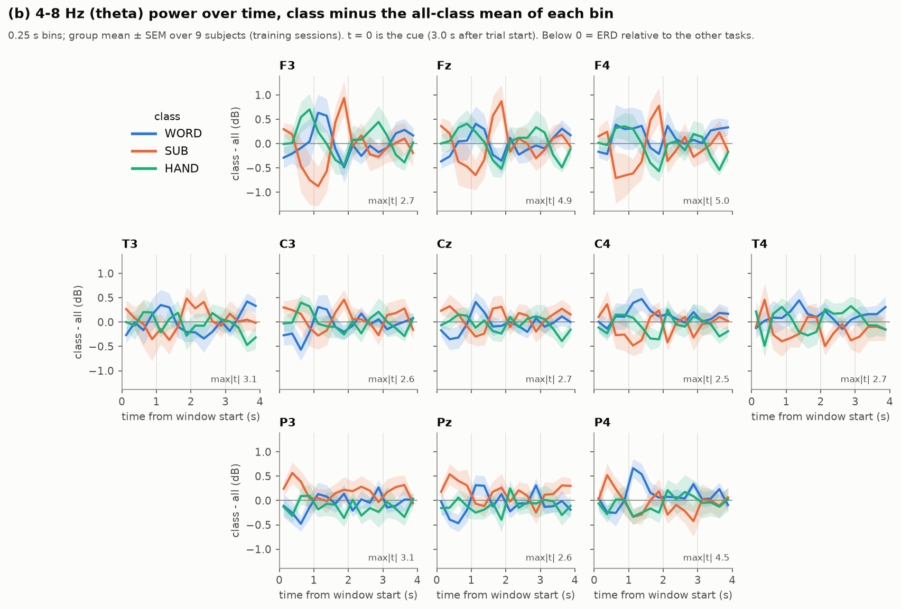
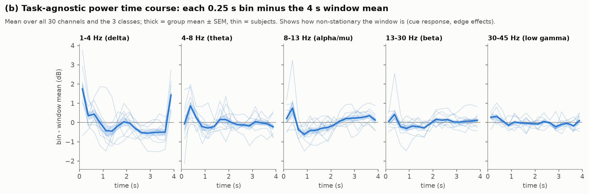
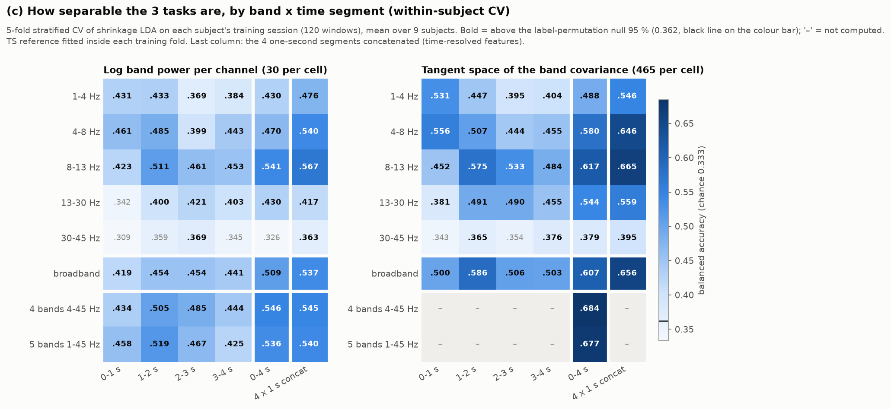
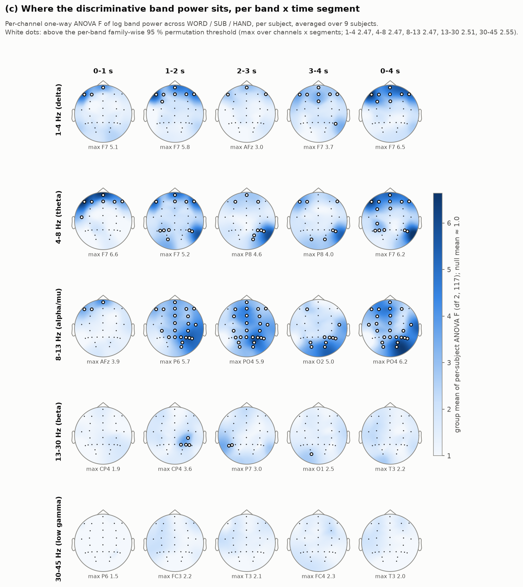
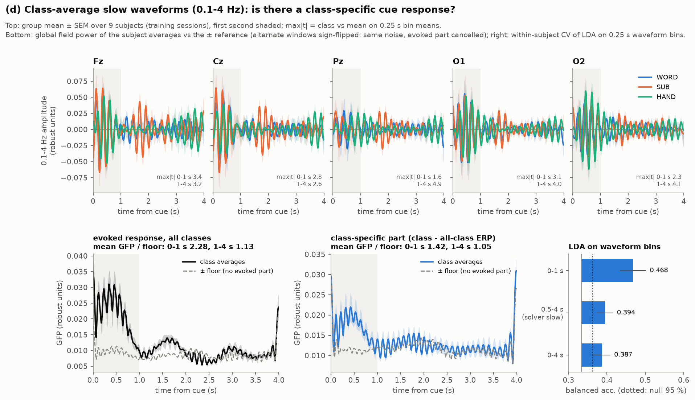
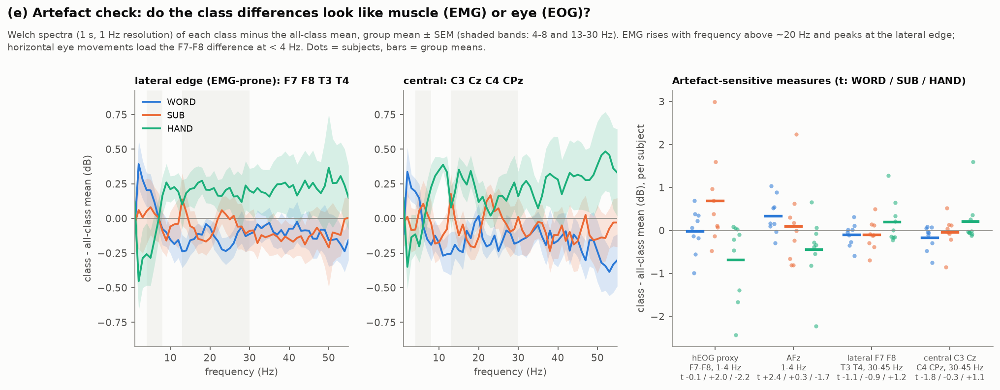

# Activation EDA: where, in which band and when WORD, SUB and HAND differ

Sealed-like proxy: Scherer 2015, cache labels 0, 1, 3 = WORD (word association),
SUB (mental subtraction), HAND (right-hand kinesthetic motor imagery). **Training
sessions only.** Sprint 2026-09-29, brief § 3 deliverable 2.
Script: `analysis/activation_eda.py`. Every number quoted here is in
[`activation_eda_numbers.md`](activation_eda_numbers.md) (auto-generated) and
[`activation_eda_summary.json`](activation_eda_summary.json).

## Summary

- **Where and which band.** The consistent, group-level differences are small,
  0.25 to 0.45 dB. WORD has less **left-frontal beta** (F3 t = −4.9, the only
  effect that survives the family-wise threshold). HAND has more **posterior
  alpha** than the two cognitive tasks (P6, Pz, PO3, P8, PO4, P4: t = +3.1 to
  +3.6, uncorrected). The expected C3 mu ERD for right-hand imagery does not
  stand out against the other two tasks, which also desynchronise.
- **Within each subject the classes differ much more than the group maps
  suggest.** The per-subject ANOVA F reaches 6 against a null of 1.0. The
  location and sign differ between people, so a per-subject model (as in the
  recipe) is required.
- **When.** The window is not stationary. It has a cue response in 0 to 0.5 s,
  an alpha ERD at 0.75 to 2 s and a recovery by 3 to 4 s. Alpha and beta class
  information builds up after the first second (alpha TS 0.452 at 0 to 1 s,
  0.575 at 1 to 2 s; 8/9 subjects). Delta and theta information is highest in
  the first second and sits at the most frontal channels.
- **Covariance beats power everywhere.** The tangent space (TS) is 5 to 14
  points above the log band power of the same band and segment. The 4-band TS
  over the whole window gives 0.684, against 0.546 for 4-band power (9/9
  subjects).
- **Time resolution helps single bands, and mostly the suspect ones.**
  Concatenating the TS of four 1 s segments beats the whole-window TS by +5.8
  points in delta and +6.7 in theta (8/9 subjects each). Alpha gains +4.8
  (t 1.6), beta and 30 to 45 Hz about +1.6. In the multi-band power union,
  time resolution adds nothing (−0.1 / +0.4 points).
- **Delta adds nothing** to the 4-band TS (0.677 with it vs 0.684 without),
  and **30 to 45 Hz is near chance** (power 0.326, TS 0.379).
- **Artefacts.** There is no EMG signature on this proxy. The delta and theta
  class information at F7, F8 and AFz in the first 2 s, and the
  subject-specific class effects in the F7 − F8 delta power, are consistent
  with class-specific eye movements. The class-specific slow ERP exists only
  in the first second, which is the cue response. These are the parts to keep
  out of the recipe unless they survive cross-session tests.

## Data and methods

`xsess_lib.load_study("scherer2015", classes=[0, 1, 3])` re-indexes the labels
as 0 = WORD, 1 = SUB, 2 = HAND; the script asserts this against the cache
codes 1, 2, 4. Only rows with `xsess_split(d)["train"]` are kept, i.e.
session 0. The test rows (each subject's last session, 1050 windows) are
dropped immediately after loading and never enter a computation. The script
asserts 9 subjects × 120 windows = 1080 rows, 40 per class, and no row from a
test session. The windows are what a Track 2 solver receives: 30 EEG channels
× 480 samples at 120 Hz, starting 3.0 s after trial start (t = 0 is the cue),
robust-scaled per recording. Bands are the solver's own FFT band-pass
(`xfeat.band_pass`): 1–4, 4–8, 8–13, 13–30 and 30–45 Hz, plus 0.1–4 Hz for
the slow waveform. Log power = 10·log10 of the mean square.

Group statistics: per-subject values first, then the mean and a one-sample t
across the 9 subjects (df 8). Family-wise thresholds come from exact
sign-flips (2⁹) for the t-maps and from 200 within-subject label permutations
for the ANOVA maps. Separability is 5-fold stratified CV (shuffled,
random_state = 0) of shrinkage LDA (lsqr, auto) on each subject's 120
training windows, as balanced accuracy averaged over subjects. The TS
reference is fitted inside each training fold, and OAS covariances are per
window. The chance floor is 50 label permutations × 5 bands: mean 0.335,
**95th percentile 0.362**. Runtime is 530 s on 2 threads, 1.3 GB RSS.

---

## Figures

### Montage


The 30 channels; the time-course channels of (b) are marked. The montage has
no Fp or EOG channel. F7, F8 and AFz are the most eye-sensitive sites.

### (a) Band-power topographies


- Only **WORD beta at F3** (t = −4.9, −0.28 dB; FC3 −3.8) exceeds its band's
  family-wise threshold (4.2). This fits a left-frontal, language-related beta
  desynchronisation for word association.
- **HAND alpha** is higher than the other tasks over a coherent
  posterior-right cluster (+0.3 to +0.44 dB). Each channel is below the
  family-wise 4.7, but the direction is the same in every band from 8 to
  45 Hz. The pattern is diffuse: WORD is below the mean and HAND above it at
  most channels. HAND is therefore defined by *less* desynchronisation than
  the two cognitive tasks, not by a focal C3 ERD.
- Delta, theta and 30 to 45 Hz show no group-consistent topography.

### (b) ERD/ERS time courses (class minus all-class mean, per 0.25 s bin)




- **Alpha:** the classes overlap in the first ~1.5 s and separate after
  that. From about 2 s, HAND is above the others at Cz, Fz, Pz and P4 (Cz
  t = +5.1 at 2.4 s). WORD is below at F3, Cz and T3 at 1.5 to 3 s (F3 −4.7,
  Cz −4.5). SUB is lowest at P4 (−3.6 at 1.4 s).
- **Beta:** WORD is below the other two for the whole window at F3 and
  fronto-centrally (−0.25 dB, peak t −5.4). This effect is sustained, so a
  whole-window feature already captures it.
- **Theta:** SUB has a frontal transient at F3, Fz and F4, a dip at 0.5 to
  1.2 s and then a ~+0.9 dB peak at ~1.8 s (single-bin t ≤ 2.7). HAND has less
  frontal theta late in the window (Fz −4.9, F4 −5.0 at 3.6 s). The SUB
  transient is time-locked and frontal, so it could be blinks or saccades.
- Each band has 528 bin × channel × class tests. Isolated single-bin |t| of 4
  to 5 is expected now and then, so only effects that persist over several
  bins and channels are interpreted.



The window is strongly non-stationary. At 0.25 to 0.5 s there is a
cue-locked burst: theta +0.9 dB, alpha +0.75, beta +0.4. The alpha ERD
reaches −0.6 dB at ~0.9 s and recovers to +0.3 by 3.5 s. Delta is +1.75 dB in
the first bin and **+1.43 dB in the last bin**. Nothing happens at 7 s after
trial start, so the last one is an edge effect of the FFT band-pass
(reflect padding). The first bin mixes edge and cue. Any 1 s segment block
inherits these edge-inflated end segments in the delta band.

### (c) Separability by band × time segment


- **Which band.** Alpha carries the most information (power 0.541, TS
  0.617), then theta (0.470 / 0.580) and beta (0.430 / 0.544). The 30 to 45 Hz
  band is at or near chance (0.326 / 0.379). Broadband log-variance, the
  recipe's `logvar` block, reaches 0.509 and the broadband TS 0.607.
- **Covariance vs power.** TS is above power in nearly every cell. In the
  4-band union it is +13.8 points, 9/9 subjects (0.684 vs 0.546). Adding
  1–4 Hz to the 4-band TS changes it by −0.7 points (3/9 subjects better).
- **When.** Delta and theta TS are best in 0 to 1 s (0.531 / 0.556). Delta
  falls below its whole-window value in 2 to 4 s (8/9 and 9/9 subjects).
  Alpha TS is worst in 0 to 1 s (0.452) and best at 1 to 2 s (0.575, +12.3
  points, 8/9 subjects).
- **Time resolution.** The 4 × 1 s concatenated TS beats the whole-window TS
  in delta (+5.8, t 4.9, 8/9), theta (+6.7, t 4.0, 8/9) and broadband
  (+4.8, t 2.2), less clearly in alpha (+4.8, t 1.6) and not in beta or
  30 to 45 Hz (+1.6). The best time-resolved single band (alpha, 0.665) does
  not beat the whole-window 4-band TS (0.684; 3/9 subjects). For power, the
  per-band gains disappear in the union (4 bands −0.1, 5 bands +0.4). The
  time-resolved multi-band TS (7440+ features) was not computed; the Phase 2
  screen measures `tseg` directly.
- Subjects vary widely. The 4-band TS ranges from 0.50 to 0.87, and S1 and S6
  stay at or below ~0.5 in every cell.



- **Delta and theta** discriminative power sits at **F7, F8, AFz and F3**:
  F up to 6.5 against a null of 1.0 and a family-wise 95 % threshold of 2.5.
  It is strongest in 0 to 2 s. Theta also has a posterior-right source (P8,
  P6) in 1 to 4 s.
- **Alpha** sits posterior and right (PO4 6.2, O2 6.1, P6, P8, P4), is
  widespread over 1 to 3 s, and is weak and frontal in 0 to 1 s. **Beta** is
  weak (CP4 3.6 at 1 to 2 s). **30 to 45 Hz** has nothing above threshold.
- F reaches ~6 where the group t in (a) is ≤ 3.6. The class differences are
  therefore reliable within a subject but differ in sign or location between
  subjects.

### (d) Cue-evoked slow waveform (0.1–4 Hz)


- There is a strong evoked response to the cue. The global field power of
  the all-class average is **2.28×** the ± noise floor in 0 to 1 s and 1.13×
  after that.
- A **class-specific** part exists **only in the first second**: 1.42× the
  floor, against 1.05× in 1 to 4 s. LDA on 0.25 s waveform bins gives 0.468
  for 0 to 1 s. The solver's `slow` block (0.5 to 4 s) gives 0.394, +7.3
  points lower (t 2.3, 6/9 subjects), and 0 to 4 s gives 0.387.
- The group t at single channels is ≤ 3.9 (AFz, HAND), so the class-specific
  waveforms are subject-specific. The cue tells the participant which task to
  do, so it necessarily differs by class. This part is therefore most likely
  a response to the instruction plus early eye movements, not sustained task
  activity.
- The GFP rises at both window edges, which confirms the filter-edge effect.

### (e) Artefact check


- **No EMG signature.** No class shows a class-difference spectrum that
  rises above ~20 Hz and peaks at the lateral edge. WORD is *below* the mean
  at 8 to 55 Hz (lateral 30 to 45 Hz −0.08 dB, t −0.7). HAND is +0.2 to
  +0.36 dB above 30 Hz at lateral and central sites alike (t ≤ 1.3), which is
  a diffuse offset, not a muscle topography.
- **Eye-movement signs.** The F7 − F8 delta power, a horizontal-EOG proxy,
  differs by class within subjects: SUB +0.69 dB (t +2.0), HAND −0.68
  (t −2.2), with single subjects at +3.0 and −2.4 dB. AFz delta is +0.34 dB
  for WORD (t +2.4). Together with the F7/F8/AFz locus of the delta and theta
  ANOVA, this points to subject-specific, class-specific eye behaviour. The
  proxy has no EOG channel, so this is indirect.

---

## Implications for feature design

The candidate blocks are those of brief § 4. The verdicts are hypotheses for
the cross-session screen, not results. Within-session CV is optimistic: the
recipe scores 0.493 cross-session per subject, against 0.684 here for the
4-band TS alone.

| block | EDA verdict | evidence | note for the screen |
|---|---|---|---|
| `tseg2`, `tseg3` | **supported, with a caveat** | The window is non-stationary (cue burst, ERD at 0.75–2 s, recovery). The per-band 4 × 1 s TS beats the whole-window TS: delta +5.8, theta +6.7 (8/9 each), alpha +4.8 (7/9), beta +1.6. Alpha information peaks after 1 s. | The gain is largest where the information is early and frontal (delta, theta: cue/eye-suspect), and the brief's FB has theta but no delta. The union was not computed here. `tseg2` separates cue + ERD from the sustained phase at the lowest cost. |
| `bpt4` | weak | The power concat gains per band (theta +6.9, delta +4.6, alpha +2.6) vanish in the 4- and 5-band unions (−0.1 / +0.4). TS beats power by 5–14 points. | Low priority. Expect ≈ 0 on top of the FB TS. |
| `fb8` | neutral | Alpha dominates, and 30–45 Hz is near chance. The 8–10 / 10–13 Hz and beta sub-band splits were not tested. The 1–4 Hz band that `fb8` adds is not useful (next row). | No EDA reason to expect a gain beyond noise. |
| `fbd` | **not supported** | The 4-band TS + 1–4 Hz is 0.677 vs 0.684 without (3/9 better). Delta information is frontal and in the first second (eye/cue). | Expect ≤ 0. It carries the highest artefact risk of the candidates. |
| `slow` (`sl=1`) | **not supported as defined** | The class-specific slow ERP lives in 0–1 s (GFP ratio 1.42, LDA 0.468). The block covers 0.5–4 s (LDA 0.394), and after 1 s the class-specific ERP is at the noise floor (ratio 1.05). | Expect ≈ 0. A 0–1 s variant would be cue/eye-driven: do not add one. |
| `fblv`, `fbrlv` | weak | TS beats power in every band (4-band union +13.8, 9/9). The group topographies are small (≤ 0.45 dB) and subject-specific. The recipe already has broadband log-variance. | A diagonal-only view of what the TS holds. `fbrlv` would also remove the diffuse WORD-low / HAND-high offset, which is part of the signal. |
| `reg` | plausible | The information is regional: posterior-right alpha, left-frontal beta (WORD), frontal delta/theta. | Fewer parameters per region may help at 120 windows. The frontal region will carry ocular signal. |
| `csp8` | plausible | F ≈ 6 within subjects with group t ≤ 3.6 means subject-specific spatial patterns, the case supervised low-rank filters are built for. | Fits per-subject training (blend) better than pooled. The FB starts at 4 Hz, so it has less ocular exposure. |
| `icoh` | no evidence either way | TS > power (+5 to +14 points) shows that cross-channel structure matters. Zero-lag and lagged coupling are not separated here. | Neutral. |
| `acm3x2`, `acm2x4` | not tested | Temporal autocorrelation was not examined. | Neutral. |
| `ref=car`, `ref=laplacian` | control | n/a | Predicted ≈ 0 (brief § 1). |

**Possible EDA-motivated candidates** (the brief allows ≤ 2 after Phase 1b,
named and justified in the LOG before they run):

1. **A cue/task split of `tseg`**, FB covariance TS over [0–1 s] and
   [1–4 s]. The first second is a different regime: cue burst, delta/theta
   information, no alpha discrimination yet. Alpha and beta class information
   lives in 1–4 s. Equal halves (`tseg2`) put the boundary at 2 s, which is
   inside the alpha build-up.
2. **A "skip the cue second" control**: the recipe's FB TS on 1–4 s only.
   It measures how much of the recipe's accuracy depends on the cue and eye
   period. On the release data this is the most direct artefact-robustness
   check.

## Caution: EMG and eye artefacts

The sealed data has EMG and EOG channels. The official loader probably
delivers EEG only (sprint 0928 notes), but eye and muscle signals leak into
frontal and temporal EEG regardless. A recipe that learns them can collapse
across days, because eye strategies and muscle tension are behaviour, not
stable brain responses.

- **EMG.** Not seen on this proxy. WORD, the class most prone to
  sub-vocalisation, has *less* 8 to 55 Hz power, and 30 to 45 Hz carries
  almost no class information. The sealed participants may differ (overt
  sub-vocalisation in word association, micro-movements in hand imagery).
  Release-day check: class-difference spectra above 30 Hz on the EMG channels
  and on T7/T8/F7/F8/FT7/FT8. If they rise with frequency and peak at the
  edge, drop the 30–45 Hz FB band. On this proxy that band is near chance,
  so dropping it costs ~nothing here.
- **Eye movements.** Likely present. The strongest delta/theta class
  information is at F7/F8/AFz in the first 2 s, the F7 − F8 delta power
  differs by class within subjects with opposite signs across subjects, and
  SUB has a frontal theta transient at ~1.8 s. The recipe's FB starts at
  4 Hz, but xDAWN, the broadband TS and log-variance are broadband, so they
  see delta. Release-day checks:
  1. class-wise EOG-channel delta power per session and its day-to-day
     stability;
  2. the recipe with frontal delta removed (a 4 Hz high-pass on the
     broadband blocks, or EOG regression) as an ablation.

  Do not add delta blocks (`fbd`, `slow`) unless they pass the cross-session
  screen.
- **Cue response.** Class-specific activity in the first second (GFP 1.42×
  the floor) is legitimate if the sealed windows contain a class-specific cue
  that is the same at test time. Whether the sealed windows start at the cue
  is not known yet.

## Limits

- 9 subjects, one 120-window session each: the SEMs of cell means are 2 to
  5 points, so differences below ~3 points are not interpretable.
- Within-session CV is optimistic relative to cross-session transfer.
  Features that separate within a session but drift across days (eye
  strategies, artefacts) look good here. Rankings are therefore hypotheses
  for the cross-session screen.
- The LDA-on-power and single-band TS models are not the recipe. The union
  effects of `tseg` and the other blocks are measured in Phase 2.
- Robust scaling per recording distorts absolute topographies; within-subject
  class contrasts are unaffected. The FFT band-pass inflates the first and
  last ~0.25 s in the delta band.
- The ERD/ERS panels show 528 tests per band, so single-bin peaks are read
  with care. The t-maps give the family-wise thresholds per band.

## Reproduce

```bash
source ~/codabench/env.sh
export XS_THREADS=2 OMP_NUM_THREADS=2 OPENBLAS_NUM_THREADS=2 MKL_NUM_THREADS=2 PYTHONUTF8=1
python ~/codabench/analysis/activation_eda.py            # full run, ~9 min
python ~/codabench/analysis/activation_eda.py --replot   # figures + numbers from cached stats
```

The first log line is the data-shape check. It must read
`TRAIN rows 1080 = 9 subjects x 120 (40/class, sessions [0]); test rows used 0`.
