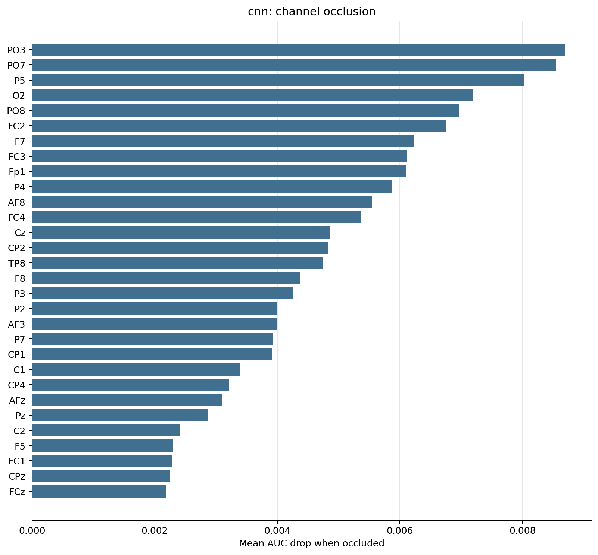
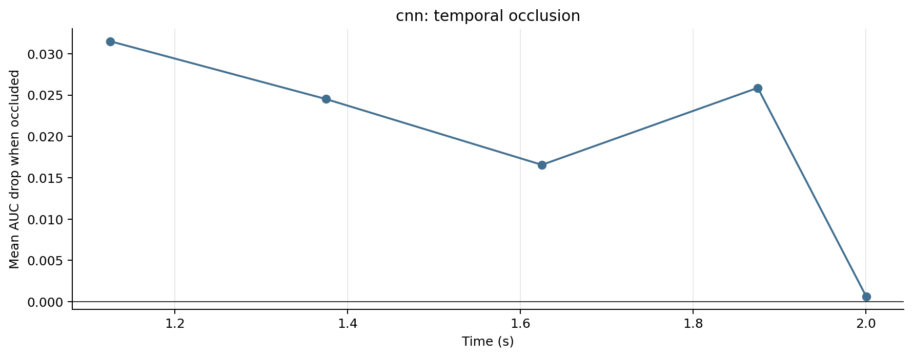

# CNN Tensor Model Diagnostics

_Generated 2026-05-30 19:16:21 by `scripts/08_tensor_model_diagnostics.py`._

## Inputs

- Run: `cnn_cohort_starter`
- Participants: P01, P02, P03, P05, P06, P07, P08, P10, P11, P12, P13, P14, P15
- Feature window: 1.0 to 2.0 s
- Time occlusion bin: 0.250 s

## Caveat

This is an interpretability probe, not a held-out performance estimate. The model is refit on all available epochs for each participant, then channels/time windows are masked to see which inputs the fitted model appears to rely on.

## Summary

| participant | model | n_epochs | n_channels | n_times | sfreq | tmin | tmax | baseline_auc | baseline_accuracy | top_channel | top_channel_delta_auc | top_time_window | top_time_delta_auc |
|---|---|---|---|---|---|---|---|---|---|---|---|---|---|
| P01 | cnn | 80 | 64 | 1025 | 1024.00 | 1.000 | 2.000 | 0.6175 | 0.5875 | FC2 | +0.0356 | 1.000-1.250s | +0.0569 |
| P02 | cnn | 80 | 64 | 1025 | 1024.00 | 1.000 | 2.000 | 0.5266 | 0.5250 | TP8 | +0.0184 | 1.250-1.500s | +0.0484 |
| P03 | cnn | 80 | 64 | 1025 | 1024.00 | 1.000 | 2.000 | 0.5906 | 0.5625 | PO3 | +0.0269 | 1.750-2.000s | +0.0656 |
| P05 | cnn | 80 | 64 | 1025 | 1024.00 | 1.000 | 2.000 | 0.6131 | 0.5375 | O2 | +0.0350 | 1.750-2.000s | +0.0575 |
| P06 | cnn | 80 | 64 | 1025 | 1024.00 | 1.000 | 2.000 | 0.6038 | 0.5750 | FC5 | +0.0556 | 1.750-2.000s | +0.1181 |
| P07 | cnn | 80 | 64 | 1025 | 1024.00 | 1.000 | 2.000 | 0.4556 | 0.5250 | Fz | +0.0194 | 1.750-2.000s | +0.0419 |
| P08 | cnn | 69 | 64 | 1025 | 1024.00 | 1.000 | 2.000 | 0.4832 | 0.4783 | C3 | +0.0202 | 1.500-1.750s | +0.0968 |
| P10 | cnn | 80 | 64 | 1025 | 1024.00 | 1.000 | 2.000 | 0.6050 | 0.4875 | T8 | +0.0350 | 1.250-1.500s | +0.0731 |
| P11 | cnn | 80 | 64 | 1025 | 1024.00 | 1.000 | 2.000 | 0.5869 | 0.5375 | FC1 | +0.0250 | 1.750-2.000s | +0.0762 |
| P12 | cnn | 80 | 64 | 1025 | 1024.00 | 1.000 | 2.000 | 0.6275 | 0.5875 | P2 | +0.0300 | 1.000-1.250s | +0.0731 |
| P13 | cnn | 80 | 64 | 1025 | 1024.00 | 1.000 | 2.000 | 0.5437 | 0.5375 | O1 | +0.0350 | 1.000-1.250s | +0.1175 |
| P14 | cnn | 80 | 64 | 1025 | 1024.00 | 1.000 | 2.000 | 0.5637 | 0.5750 | AF8 | +0.0312 | 1.000-1.250s | +0.1475 |
| P15 | cnn | 80 | 64 | 1025 | 1024.00 | 1.000 | 2.000 | 0.5312 | 0.5000 | FC3 | +0.0294 | 1.500-1.750s | +0.0612 |

## Channel Occlusion

### Top Channels

| channel | delta_auc |
|---|---|
| PO3 | +0.0087 |
| PO7 | +0.0085 |
| P5 | +0.0080 |
| O2 | +0.0072 |
| PO8 | +0.0070 |
| FC2 | +0.0068 |
| F7 | +0.0062 |
| FC3 | +0.0061 |
| Fp1 | +0.0061 |
| P4 | +0.0059 |
| AF8 | +0.0055 |
| FC4 | +0.0054 |
| Cz | +0.0049 |
| CP2 | +0.0048 |
| TP8 | +0.0048 |

## Time Occlusion

### Top Time Windows

| time_window | delta_auc |
|---|---|
| 1.000-1.250s | +0.0315 |
| 1.750-2.000s | +0.0259 |
| 1.250-1.500s | +0.0245 |
| 1.500-1.750s | +0.0166 |
| 2.000-2.001s | +0.0006 |

## Output Files

- `channel_occlusion.csv`: one row per participant-channel mask.
- `time_occlusion.csv`: one row per participant-time-window mask.
- `participant_summary.csv`: baseline and top occlusion summaries.
