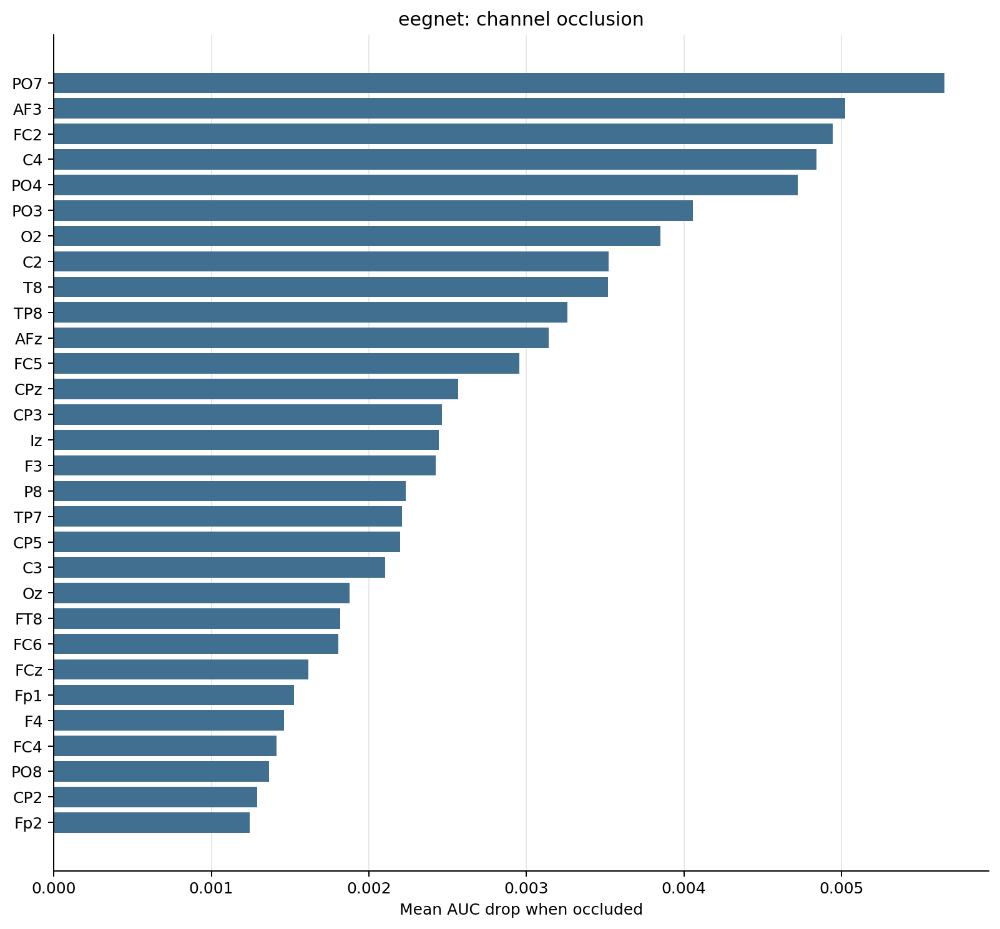
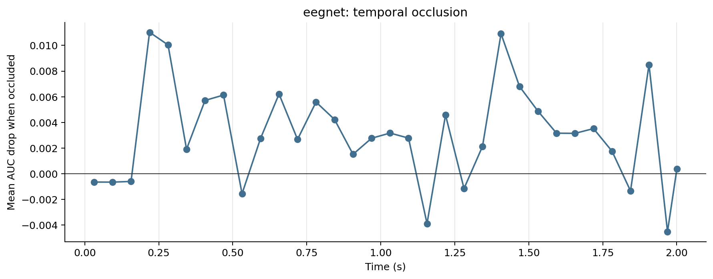

# EEGNET Tensor Model Diagnostics

_Generated 2026-05-30 19:50:51 by `scripts/08_tensor_model_diagnostics.py`._

## Inputs

- Run: `eegnet_cohort_starter`
- Participants: P01, P02, P03, P05, P06, P07, P08, P10, P11, P12, P13, P14, P15
- Feature window: 0.0 to 2.0 s
- Time occlusion bin: 0.062 s

## Caveat

This is an interpretability probe, not a held-out performance estimate. The model is refit on all available epochs for each participant, then channels/time windows are masked to see which inputs the fitted model appears to rely on.

## Summary

| participant | model | n_epochs | n_channels | n_times | sfreq | tmin | tmax | baseline_auc | baseline_accuracy | top_channel | top_channel_delta_auc | top_time_window | top_time_delta_auc |
|---|---|---|---|---|---|---|---|---|---|---|---|---|---|
| P01 | eegnet | 80 | 64 | 2049 | 1024.00 | 0.000 | 2.000 | 0.6256 | 0.6000 | P1 | +0.0200 | 0.188-0.250s | +0.0300 |
| P02 | eegnet | 80 | 64 | 2049 | 1024.00 | 0.000 | 2.000 | 0.7125 | 0.6875 | O2 | +0.0331 | 1.125-1.188s | +0.0381 |
| P03 | eegnet | 80 | 64 | 2049 | 1024.00 | 0.000 | 2.000 | 0.6606 | 0.5875 | FC2 | +0.0294 | 1.188-1.250s | +0.0713 |
| P05 | eegnet | 80 | 64 | 2049 | 1024.00 | 0.000 | 2.000 | 0.7056 | 0.6750 | Oz | +0.0275 | 0.750-0.812s | +0.0419 |
| P06 | eegnet | 80 | 64 | 2049 | 1024.00 | 0.000 | 2.000 | 0.7269 | 0.6000 | PO3 | +0.0344 | 0.250-0.312s | +0.0569 |
| P07 | eegnet | 80 | 64 | 2049 | 1024.00 | 0.000 | 2.000 | 0.5794 | 0.5500 | Cz | +0.0144 | 0.188-0.250s | +0.0106 |
| P08 | eegnet | 69 | 64 | 2049 | 1024.00 | 0.000 | 2.000 | 0.6658 | 0.6377 | AFz | +0.0227 | 1.875-1.938s | +0.0480 |
| P10 | eegnet | 80 | 64 | 2049 | 1024.00 | 0.000 | 2.000 | 0.5956 | 0.5500 | F4 | +0.0175 | 1.312-1.375s | +0.0306 |
| P11 | eegnet | 80 | 64 | 2049 | 1024.00 | 0.000 | 2.000 | 0.6431 | 0.5875 | PO8 | +0.0175 | 1.250-1.312s | +0.0444 |
| P12 | eegnet | 80 | 64 | 2049 | 1024.00 | 0.000 | 2.000 | 0.6819 | 0.6375 | PO7 | +0.0188 | 0.188-0.250s | +0.0494 |
| P13 | eegnet | 80 | 64 | 2049 | 1024.00 | 0.000 | 2.000 | 0.9387 | 0.7875 | PO4 | +0.0106 | 0.250-0.312s | +0.0287 |
| P14 | eegnet | 80 | 64 | 2049 | 1024.00 | 0.000 | 2.000 | 0.6244 | 0.6125 | FCz | +0.0241 | 0.625-0.688s | +0.0188 |
| P15 | eegnet | 80 | 64 | 2049 | 1024.00 | 0.000 | 2.000 | 0.8175 | 0.7500 | PO4 | +0.0200 | 0.438-0.500s | +0.0262 |

## Channel Occlusion

### Top Channels

| channel | delta_auc |
|---|---|
| PO7 | +0.0057 |
| AF3 | +0.0050 |
| FC2 | +0.0049 |
| C4 | +0.0048 |
| PO4 | +0.0047 |
| PO3 | +0.0041 |
| O2 | +0.0039 |
| C2 | +0.0035 |
| T8 | +0.0035 |
| TP8 | +0.0033 |
| AFz | +0.0031 |
| FC5 | +0.0030 |
| CPz | +0.0026 |
| CP3 | +0.0025 |
| Iz | +0.0024 |

## Time Occlusion

### Top Time Windows

| time_window | delta_auc |
|---|---|
| 0.188-0.250s | +0.0110 |
| 1.375-1.438s | +0.0109 |
| 0.250-0.312s | +0.0100 |
| 1.875-1.938s | +0.0085 |
| 1.438-1.500s | +0.0068 |
| 0.625-0.688s | +0.0062 |
| 0.438-0.500s | +0.0061 |
| 0.375-0.438s | +0.0057 |
| 0.750-0.812s | +0.0056 |
| 1.500-1.562s | +0.0049 |
| 1.188-1.250s | +0.0046 |
| 0.812-0.875s | +0.0042 |
| 1.688-1.750s | +0.0035 |
| 1.000-1.062s | +0.0032 |
| 1.562-1.625s | +0.0032 |

## Output Files

- `channel_occlusion.csv`: one row per participant-channel mask.
- `time_occlusion.csv`: one row per participant-time-window mask.
- `participant_summary.csv`: baseline and top occlusion summaries.
