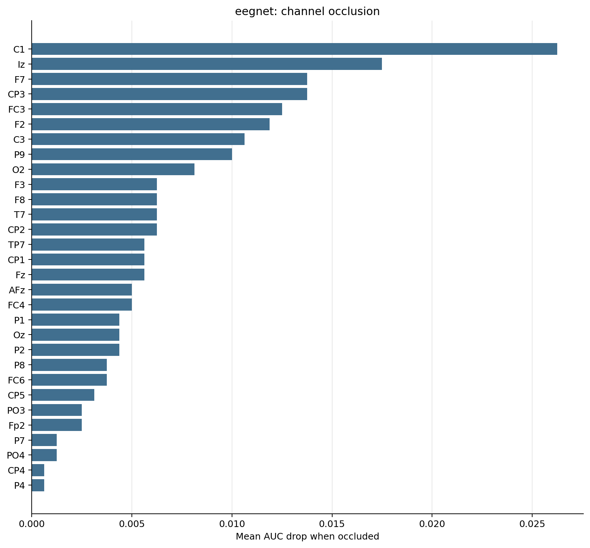
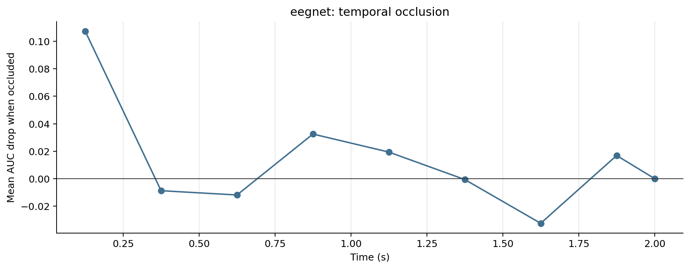

# EEGNET Tensor Model Diagnostics

_Generated 2026-05-29 21:48:02 by `scripts/08_tensor_model_diagnostics.py`._

## Inputs

- Run: `eegnet_p25_starter`
- Participants: P25
- Feature window: 0.0 to 2.0 s
- Time occlusion bin: 0.250 s

## Caveat

This is an interpretability probe, not a held-out performance estimate. The model is refit on all available epochs for each participant, then channels/time windows are masked to see which inputs the fitted model appears to rely on.

## Summary

| participant | model | n_epochs | n_channels | n_times | sfreq | tmin | tmax | baseline_auc | baseline_accuracy | top_channel | top_channel_delta_auc | top_time_window | top_time_delta_auc |
|---|---|---|---|---|---|---|---|---|---|---|---|---|---|
| P25 | eegnet | 80 | 64 | 2049 | 1024.00 | 0.000 | 2.000 | 0.7619 | 0.7125 | C1 | +0.0262 | 0.000-0.250s | +0.1075 |

## Channel Occlusion

### Top Channels

| channel | delta_auc |
|---|---|
| C1 | +0.0262 |
| Iz | +0.0175 |
| F7 | +0.0138 |
| CP3 | +0.0138 |
| FC3 | +0.0125 |
| F2 | +0.0119 |
| C3 | +0.0106 |
| P9 | +0.0100 |
| O2 | +0.0081 |
| F8 | +0.0062 |
| F3 | +0.0062 |
| CP2 | +0.0062 |
| T7 | +0.0062 |
| CP1 | +0.0056 |
| TP7 | +0.0056 |

## Time Occlusion

### Top Time Windows

| time_window | delta_auc |
|---|---|
| 0.000-0.250s | +0.1075 |
| 0.750-1.000s | +0.0325 |
| 1.000-1.250s | +0.0194 |
| 1.750-2.000s | +0.0169 |
| 2.000-2.001s | +0.0000 |
| 1.250-1.500s | -0.0006 |
| 0.250-0.500s | -0.0088 |
| 0.500-0.750s | -0.0119 |
| 1.500-1.750s | -0.0325 |

## Output Files

- `channel_occlusion.csv`: one row per participant-channel mask.
- `time_occlusion.csv`: one row per participant-time-window mask.
- `participant_summary.csv`: baseline and top occlusion summaries.
